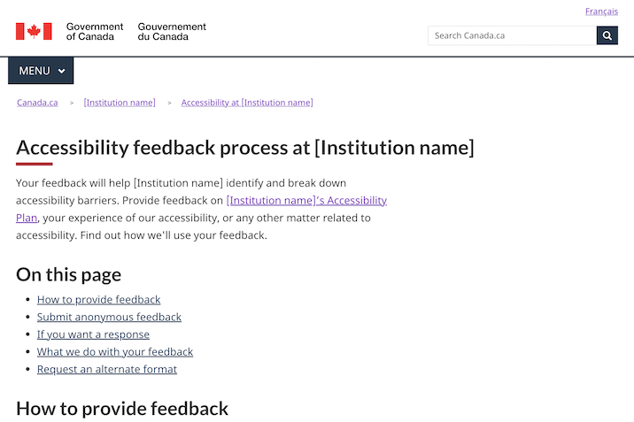

Last updated: October 19, 2023

Experimental

The accessibility feedback form template is for enabling an institution to receive online feedback about its accessibility plans and reports, as well as any aspect of its programs services. This template consists of the form itself, as well as an acknowledgemnt page for when form input has been submitted.

 

## On this page

*   [When to use](#when-to-use)
*   [What to avoid](#what-to-avoid)
*   [Content and design](#content-and-design)
*   [How to implement](#how)
*   [Research and rationale](#research)
*   [Latest changes](#latest)

## When to use

Use this template when publishing an online form for receiving accessibility feedback.

## What to avoid

Don't create more than one accessibility feedback form per department or agency.

## Content and design

Find content and design specifications and visual examples.

### Content specifications

The accessibility feedback form template consists of 2 parts:

* a single-page intake form that collects input
* an acknowledgement page that appears once input has been submitted

The template was designed to meet the requirements for feedback processes outlined in the ESDC guidance on the Accessible Canada Regulations: 

*  [Guidance on descriptions of processes for accessibility feedback](https://www.canada.ca/en/employment-social-development/programs/accessible-canada-regulations-guidance/feedback-process.html)

The template my be adjusted to meet your institution's needs. By default, it includes the following elements.

#### Intake form

*   **Introductory text** - a brief introduction that describes the purpose of the form and includes a link to the feedback process description
*   **4 questions**:
    *   **What do you want to provide feedback on?** - radio buttons with options to categorize whether the feedback is about an accessibility barrier, the institution's accessibility plan, or something else (if the other option is chosen, a text box appears for capturing a description)
    *   **Select the areas that are relevant to your comments** - checkboxes with options to classify the feedback by topic
    *   **Describe the issue and provide comments** - a text box for capturing feedback
    *   **Do you want us to contact you about your feedback?** radio buttons to find out if the person filling out the form would like to be contacted (if they choose yes, a text box for inputting an email address appears)
*  A submit button alongside a cancel link button to complete form submission

#### acknowledgement page

* 2 options, depending on whether or not an email address has been submitted with the form input:
  *  email not provided: a thank you message indicating that you will not receive a response
  *  email provided: a thank you message indicating how many days it will take to receive a response
*  Both options include a link to the desripiton of the institution's feedback process

### Design specifications

* Uses standard Canada.ca styles and patterns, including large checkboxes and radio buttons that are easier to use
* Find out how to use checkboxes and radio buttons:
  *  [Checkboxes and radio buttons](https://design.canada.ca/common-design-patterns/checkboxes-radio-buttons.html) 

### Visual examples

   

      

         
Institutional accessibility page

         <figure>
            
            <figcaption>
               

                  
Detailed description

                  
Screenshot of a template for a description of an institution's feedback process. Under the title 'Accessibility feedback process at [Instiution name], you can find 5 links: How to provide feedback, Submit anonymous feedback, If you want a response, What we do with your feedback, Request an alternate format.

               

            </figcaption>
         </figure>
      

   

## How to implement

### Working examples

Copy the code from the working examples:

* [English feedback form - working example](feedback-form-example.html)
* [English feedback form acknowledgement - working example](feedback-form-acknowledgement-example.html)
* [French feedback form - working example](#)
* [French feedback form acknowledgement - working example](#)

### Connecting to a back end

You will need to connect the intake form to a back end for receiving incoming feedback, such as a generic email inbox or a ticketing system. 

* AEM users - to leverage the “file and forget” solution for hooking forms up to an email address, send a ticket to Principal Publisher 

## Research and rationale

### Research findings

This template is experimental. Research is needed to determine the optimal approach.

### Policy rationale

Under the Accessible Canada Act and Regulations, insitutions are required to maintain a feedback mechanism for receiving feedback about accessibility. An online form is one aspect of this mechanism, as people must be able to give feedback by a variety of means. This template serves as a starting point for an online institutional feedback form. 

## Latest changes

<dl>
   <dt>
      <time>2023-08-18</time>
   </dt>
   <dd>Updated the documentation to include advice on what to avoid, content and design specifications, visual examples, implementation guidance, and policy rationale</dd>
   <dt>
      <time>2022-12-23</time>
   </dt>
   <dd>Issued a working example for an institutional accessibility feedback process description</dd>
</dl>
