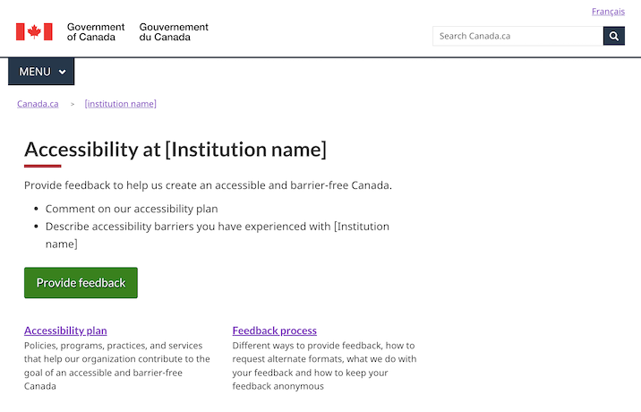

Last updated: August 16, 2023

Experimental

Institutional accessibility pages give access to a feedback mechanism as well as corporate accessibility plans and reports.

 

## On this page

*   [When to use](#when-to-use)
*   [What to avoid](#what-to-avoid)
*   [Content and design](#content-and-design)
*   [How to implement](#how)
*   [Research and rationale](#research)
*   [Latest changes](#latest)

## When to use

Use this template to create a central starting point for an institution's accessibility information and services.

## What to avoid

Don't create more than one institutional accessibility page per department or agency.

  
## Content and design

Find content and design specifications and visual examples.

### Content specifications

The institutional accessibility page consists of:

- a title
- an introduction
- a supertask button for accessibility feedback 
- links to corporate accessibility information

#### Title

The title should read "Accessibility at \[name of institution]" in English, and "Accessibilité à \[nom de l'institution]" in French.

#### Introduction

The introduction provides a brief explanation of the kind of feedback expected from users, such as input on the institution's accessibility plan or comments about accessibility barriers experienced with services.

#### Supertask button for accessibility feedback

- Since giving accessibility feedback is the top task for this page, provide a link to the feedback mechanism using a supertask button
- The label should read "Provide feedback" in English, and "Fournir une rétroaction" in French
- Find out how to use a super task button: 

    [Buttons - Canada.ca design pattern](https://design.canada.ca/common-design-patterns/buttons.html)

#### Links to corporate accessibility information

- Use services and information links (doormats) to give access to corporate accessibility information, such as accessibility plans or progress reports, or a description of the institution's process for responding to incoming feedback
- Find out how to use the services and information pattern:

    [Services and information - Canada.ca design pattern](https://design.canada.ca/common-design-patterns/services-information.html)

<h3>Design specifications</h3>

To come. 

<h3>Visual examples</h3>

   

      

         
Institutional accessibility page

         <figure>
            
            <figcaption>
               

                  
Detailed description

                  
Screenshot of a template for an institutional accessibility page. Under the title 'Accessibility at [Instiution name], you can find a button for giving feedback, and 2 links: Accessibility plan, Feedback process.

               

            </figcaption>
         </figure>
      

   

## How to implement

Copy the code from the working examples:
- [English working example](https://test.canada.ca/accessibility/landing-example.html)
- [French working example](#)

## Research and rationale

<h3>Research findings</h3>

This template is experimental. Research is needed to determine the optional approach. 

<h3>Policy rationale</h3>

Under the Accessible Canada Act and Regulations, insitutions are required to publish the following on their websites:

- an accessibility plan every 3 years
- annual accessibility reports
- a description of the process for handing accessibility feedback
- a mechanism for receiving feedback

This template helps to tie all these things together in a central location for each institution.

## Latest changes

<dl>
   <dt>
      <time>2023-08-16</time>
   </dt>
   <dd>Updated the documentation to include advice on what to avoid, content and design specifications, visual examples, implementation guidance, and policy rationale</dd>
   <dt>
      <time>2022-12-23</time>
   </dt>
   <dd>Issued a working example for an institutional accessibility page</dd>
</dl>

