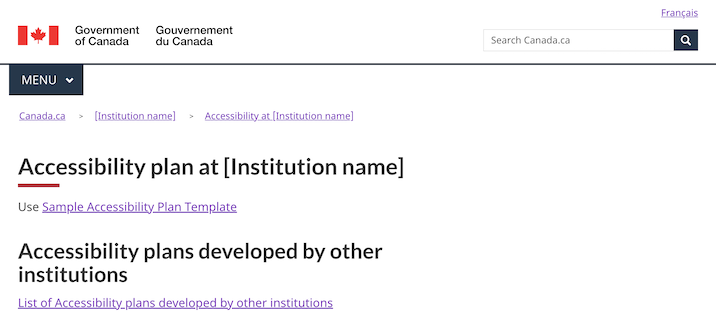

Last updated: August 16, 2023

Experimental

The accessibility plan template is for publishing an institution's accessibility plan using the Canada.ca design. 

 

## On this page

*   [When to use](#when-to-use)
*   [What to avoid](#what-to-avoid)
*   [Content and design](#content-and-design)
*   [How to implement](#how)
*   [Research and rationale](#research)
*   [Latest changes](#latest)

## When to use

Use this template when publishing your institution's accessibility plan.

## What to avoid

Don't create more than one accessibility plan per department or agency.

## Content and design

Find content and design specifications and visual examples.

### Content specifications

Ensure the plan meets the requirements outlined in the ESDC guidance on accessibility plans. This guidance includes a content template for writing the plan.

*  [Guidance on accessibility plans](https://www.canada.ca/en/employment-social-development/programs/accessible-canada-regulations-guidance/accessibility-plans.html)
*  [Sample accessibility plan template](https://www.canada.ca/en/employment-social-development/programs/accessible-canada-regulations-guidance/accessibility-plans/template.html)

People are encouraged to provide feedback on accessibility plans - ensure there is a link to the feedback process and/or feedback form directly from the plan.

To ensure findability, there is an index of all institutional accessibility plans on the open government portal. Include a link to this index directly from the plan. 

### Design specifications

* Uses standard Canada.ca styles and patterns

### Visual examples

   

      

         
Institutional accessibility page

         <figure>
            
            <figcaption>
               

                  
Detailed description

                  
Screenshot of a template for an institutional accessibility plan. Under the title 'Accessibility plan at [Instiution name], you can find a link to the sample accessibility plan template, following by a heading 'Accessibility plans developed by other institutions', then a link to the list of accessibility plans developed by other institutions.

               

            </figcaption>
         </figure>
      

   

## How to implement

### Working examples

Copy the code from the working examples:

* English working example 
* French working example

### Publishing requirements

Ensure your accessibility plan is included on the Open Government Portal: 

*  [Instructions for including accessibility plans on the open government portal](#)

According to the Mandatory procedures for publishing, institutional accessibility plans are considered publications. Request an ISSN and submit a copy to publications.gc.ca:

* [Instructions for adding accessibility plans to publications.gc.ca](#)

Institutions must notify the Accessibility Commissioner at the Canadian Human Rights Commission (CHRC) within 48 hours of publishing their accessibility plans: 

*  Send an email to Info.Com@chrc-ccdp.gc.ca or use the CHRC’s [My Accessibility Portal](https://www.accessibilitychrc.ca/en/notify-accessibility-commissioner) service

## Research and rationale

### Research findings

This template is experimental. Research is needed to determine the optimal approach.

### Policy rationale

Under the Accessible Canada Act and Regulations, insitutions are required to publish an accessibility plan every 3 years. This template ensures consistency for the accessibility plan from each institution. 

## Latest changes

<dl>
   <dt>
      <time>2023-08-16</time>
   </dt>
   <dd>Updated the documentation to include advice on what to avoid, content and design specifications, visual examples, implementation guidance, and policy rationale</dd>
   <dt>
      <time>2022-12-23</time>
   </dt>
   <dd>Issued a working example for an institutional accessibility plan</dd>
</dl>
