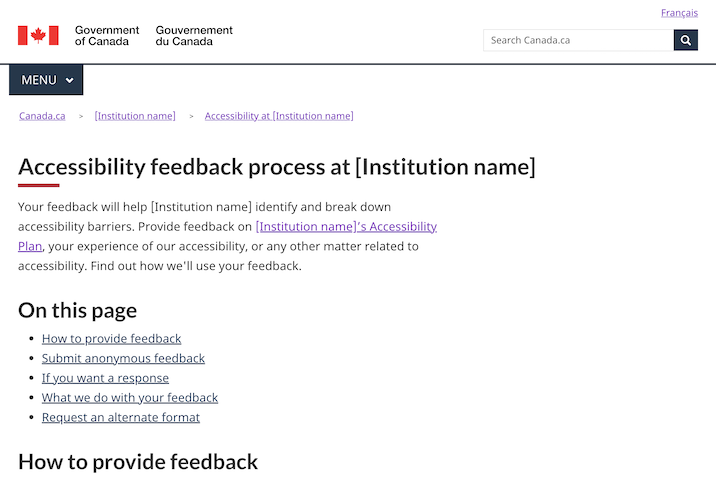

Last updated: August 18, 2023

Experimental

The accessibility feedback process template is for publishing a description of an institution's process for managing and responding to accessibility feedback. 

 

## On this page

*   [When to use](#when-to-use)
*   [What to avoid](#what-to-avoid)
*   [Content and design](#content-and-design)
*   [How to implement](#how)
*   [Research and rationale](#research)
*   [Latest changes](#latest)

## When to use

Use this template when publishing the description of your institution's process for managing and responding to accessibility feedback.

## What to avoid

Don't create more than one accessibility feedback process description per department or agency.

## Content and design

Find content and design specifications and visual examples.

### Content specifications

Ensure the feedback process description meets the requirements outlined in the ESDC guidance: 

*  [Guidance on descriptions of processes for accessibility feedback](https://www.canada.ca/en/employment-social-development/programs/accessible-canada-regulations-guidance/feedback-process.html)

This guidance includes advice for setting up the underlying process, including:
*  People must be able to provide feedback by a variety of means, including email, telephone, snail mail
*  Feedback must be analyzed and reported on in annual progress reports, so must be managed accordingly
*  If the feedback process changes, the published description must be amended

The accessibility process description template was designed to focus on top-of-mind user needs, rather than providing an exhaustive description of back-office procedures. 

The template includes the following recommended sections:
*   How to provide feedback - includes links to an online feedback form and any alternate formats, as well as contact information for providing feedback to the instituion via telephone, email or mail
*   Submit anonymous feedback - describes what to do if you want to provide feedback anonymously
*   If you want a reponse - describes what to do if you want a response to your feedback from the institution
*   What we do with your feedback - explains how the institution manages the feedback it receives
*   Request an alternate format - explains how to request an alternate format of the feedback process description

The language included in each section of the template may be adjusted to meet your institution's needs.

### Design specifications

* Uses standard Canada.ca styles and patterns

### Visual examples

   

      

         
Institutional accessibility page

         <figure>
            
            <figcaption>
               

                  
Detailed description

                  
Screenshot of a template for a description of an institution's feedback process. Under the title 'Accessibility feedback process at [Instiution name], you can find 5 links: How to provide feedback, Submit anonymous feedback, If you want a response, What we do with your feedback, Request an alternate format.

               

            </figcaption>
         </figure>
      

   

## How to implement

### Working examples

Copy the code from the working examples:

* [English working example](feedback-process-example.html) 
* [French working example](#)

### Publishing requirements

Institutions must notify the Accessibility Commissioner at the Canadian Human Rights Commission (CHRC) within 48 hours of publishing their accessibility feedback process descriptions: 

*  Send an email to Info.Com@chrc-ccdp.gc.ca or use the CHRC’s [My Accessibility Portal](https://www.accessibilitychrc.ca/en/notify-accessibility-commissioner) service

## Research and rationale

### Research findings

This template is experimental. Research is needed to determine the optimal approach.

### Policy rationale

Under the Accessible Canada Act and Regulations, insitutions are required to publish aa description of their process for dealing with accessibility feedback. This template enables consistency in the accessibility feedback process descriptions from each institution. 

## Latest changes

<dl>
   <dt>
      <time>2023-08-18</time>
   </dt>
   <dd>Updated the documentation to include advice on what to avoid, content and design specifications, visual examples, implementation guidance, and policy rationale</dd>
   <dt>
      <time>2022-12-23</time>
   </dt>
   <dd>Issued a working example for an institutional accessibility feedback process description</dd>
</dl>
