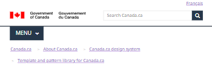

<section class="experimental alpha-top">
<h2 class="wb-inv">Alpha</h2>

<small>
<label class="alpha-label">Alpha</label>
This is an experimental version of Canada.ca for public testing.
</small>

</section>
---
altLangPage: "#"
breadcrumbs:
  - title: Breadcrumbs pattern
    link: "https://design.canada.ca/common-design-patterns/breadcrumb-trail.html"
css:
- https://design.canada.ca/css/split-h1.css
- https://design.canada.ca/css/custom.css
- https://use.fontawesome.com/releases/v5.15.4/css/all.css
date: 2023-02-23
dateModified: 2023-02-23
description: "Standard page with breadcrumbs"
lang: en
layout: without-h1
pageclass: cnt-wdth-lmtd
title: "Breadcrumb trail"
---
<h1 property="name" id="wb-cont" dir="ltr">Closed: Canada Housing Benefit</h1>
Status: This benefit is closed

This is a mockup of the future state of the Breadcrumb trail pattern.

The breadcrumb trail is a horizontal series of links that gives people a sense of where they are in relation to Canada.ca’s navigation model.  It represents the location of a page in relation to its parent and provides a clear way to navigate to higher levels in the site structure.

<h2>Way they coded</h2>

		

			<section class="gc-features">
				<h2 class="wb-inv">Features</h2>
				

					

   <h2 class="h5 mrgn-tp-0">Inspired to create your own open data project?</h2> 
   
Explore how Canadians are using open data to power innovation and its impact on communities.
 
   
<a class="btn btn-success" href="https://open.canada.ca/en/stories" role="button">Get started</a>
 
					

				

			</section>
      <h2>Way I coded</h2>
     <section class="gc-features">
	     

		

	     <h2 class="wb-inv">Features</h2>
				

					

   
Inspired to create your own open data project?
 
   
Explore how Canadians are using open data to power innovation and its impact on communities.
 
   
<a class="btn btn-success" href="https://open.canada.ca/en/stories" role="button">Get started</a>
 
					

				

		

     

	     </section>
<figure>
  <figcaption class="caption">Breadcrumb trail</figcaption>
  </figure>
<h2>On this page</h2>
<ul>
  <li>When to use</li>
  <li>What to avoid</li>
  <li>Content and design</li>
  <li>How to implement</li>
  <li>Latest changes</li>
  <li>Discussion</li>
</ul>
<h2>When to use</h2>

The breadcrumb trail is mandatory on all pages except transactional pages.

<h2>What to avoid</h2>

Don’t program the breadcrumb trail to be generated dynamically based on a visitor’s journey to a page. It should represent the location of a page as it stands in relation to the site’s navigation model.

Avoid long link labels. Use a shortened version of the page title if necessary.

Don’t display the current page at the end of the breadcrumb trail (linked or unlinked). It increases the length of the breadcrumb unnecessarily, especially on mobile. The heading of the page is enough to let people know where they are.

<h2>Content and design</h2>

Find content and design specifications and visual examples.

<h3>Content specifications</h3>
<ul>
  <li>Align the breadcrumb trail to the left directly below the menu button (or the divider line if there is no menu button)</li>
  <li>Use “Canada.ca” as the text of the first breadcrumb link on standard and campaign pages</li>
  <li>Link to the Canada.ca home page in the language of the current page</li>
  <li>You can use either “Home” or the name of the process or application as the text of the first breadcrumb link on transactional pages that use a breadcrumb trail</li>
  <li>Link to the starting page of the process or the landing page of the application</li>
  <li>Breadcrumb links should reflect the title of the page</li>
  <li>Shorten the page title if necessary to reduce the space required to display the breadcrumb trail</li>
  <li>Use a single greater-than sign (&#8250;) to separate each breadcrumb link</li>
</ul>
<h4>Accessibility</h4>
<ul>
  <li>Include “You are here:” as invisible help text</li>
</ul>
<h3>Design specifications</h3>
<ul>
  <li>Type: link</li>
  <li>Position: top left</li>
  <li>Font: Noto sans</li>
  <li>Size: 16px</li>
  <li>Text colour:</li>
  <ul>
    <li>default link: #284162</li>
    <li>selected link (on hover or focus): #0535d2</li>
    <li>visited link: #7834bc</li>
  </ul>
  <li>Spacing: padding: 0 5px</li>
  <li>Icon:  \f054 (Font awesome)</li>
</ul>
<h4>Accessibility</h4>
<ul>
  <li>Code breadcrumbs as an ordered list</li>
</ul>
<h4>Examples</h4>

Usage for different locations on Canada.ca is as follows:

<strong>Services and information content</strong>

<strong>Theme pages, institutional and organizational pages</strong>

Canada.ca

<h5>First-level topic pages</strong></h5>

Canada.ca   &#8250;   [Parent theme]

<h5>Second-level topic pages</h5>

Canada.ca    &#8250;   [Parent theme]    &#8250;   [Parent topic]

<h5>Destination content pages</h5>

Canada.ca    &#8250;   [Parent theme]    &#8250;   [Parent topic]   &#8250;  [Parent sub-topic]   &#8250;   [etc.]

For example, when on the “Planning a business” page in the Business and industry theme, the breadcrumb trail will be:
  Canada.ca   &#8250;   Business   &#8250;   Starting a business

<ul class="list-unstyled">
  <li>
    

      
Corporate, program and policy content

      
<strong>Corporate, program or policy content pages</strong>

      
Canada.ca   &#8250;   [Institutional profile page]

    

  </li>
  <li>
    

      
Partnering and collaborative arrangement profile pages

      
Canada.ca

    

  </li>
  <li>
    

      
Search results pages

      
<strong>Basic search pages</strong>

      
Canada.ca

      
<strong>Advanced search pages</strong>

      
Canada.ca   &#8250;   [Basic search]

    

  </li>
  <li>
    

      
Campaigns and promotions

      
Promotion campaigns don't need a breadcrumb trail. If you add one, it can lead back to the topic tree, the Institutional/Organizational profile, or to the Home page of Canada.ca.

    

  </li>
  <li>
    

      
News

      
Canada.ca   &#8250;   [Institutional profile page]

    

  </li>
</ul>
<h3>Visual examples</h3>
<figure>
  <figcaption class="caption">Global header with breadcrumb trail  - large screen</figcaption>
  </figure>
<h2>How to implement</h2>

Find working examples for implementing the breadcrumbs.

<h3>GCweb (WET) theme implementation reference</h3>
<ul>
  <li>GCWeb (WET)</li>
  </ul>
  <h4>Implementations</h4>
  
Determine the breadcrumb order that best suits the type of page you're creating. Refer to your implementation's guidance if you want to exclude breadcrumbs.

<figure>
  <figcaption class="caption">Breadcrumb trail</figcaption>
  </figure>
