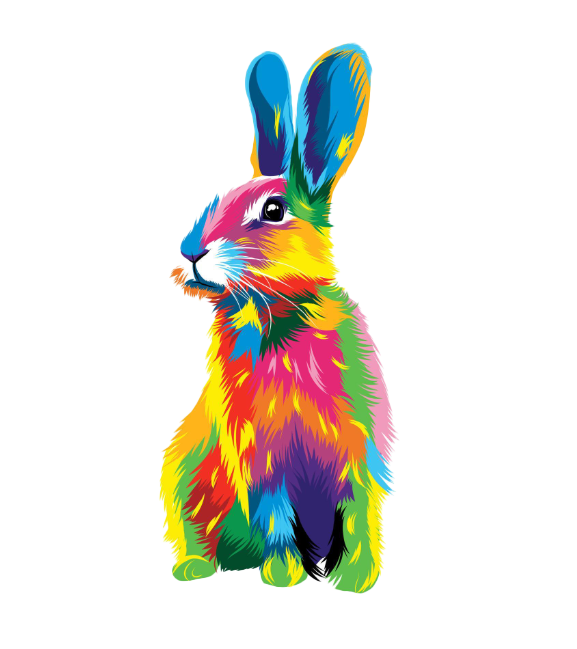

  

    <h1 property="name" id="wb-cont" dir="ltr">Agile methodology: Style Guide refinement project</h1>
    <ul class="fa-ul mrgn-tp-lg">
      <li><a href="https://canada-style-guide.atlassian.net/jira/software/projects/CCCSG/boards/2/backlog">Jira project - Canada.ca Content Style Guide</a></li>
    </ul>
    <h2 class="h3">Our use of agile</h2>
    <ul>
      <li><a href="mission-statement.html">Mission statement</a> (Jira: <a href="https://canada-style-guide.atlassian.net/browse/CCCSG-35">CCCSG-35 Mission statement</a>)</li>
      <li><a href="product-vision-statement.html">Product vision statement</a> (Jira: <a href="https://canada-style-guide.atlassian.net/browse/CCCSG-36">CCCSG-36 Product vision statement</a>)</li>
      <li><a href="story-points.html">Story points</a> (Jira: <a href="https://canada-style-guide.atlassian.net/browse/CCCSG-37">CCCSG-37 Review Story points</a>)</li>
    </ul>
  

  

    

  

