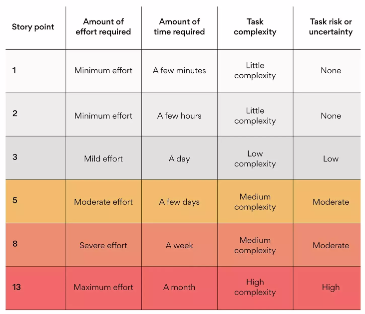

<h1 property="name" id="wb-cont" dir="ltr">Story points: JIRA</h1>

Story points estimate the amount of effort to complete a user story or task in a product backlog.   Estimate story points before a sprint planning meeting.

  

<table>
  <tr>
    <th>Story point</th>
    <th>Effort required</th>
    <th>Time required</th>
    <th>Task complexity</th>
  </tr>
  <tr>
    <td><strong>1</strong></td>
    <td>Minimum</td>
    <td>A few minutes (&#8249; 1hour)</td>
    <td>Little complexity</td>
  </tr>
  <tr>
    <td><strong>2</strong></td>
    <td>Minimum</td>
    <td>A few hours</td>
    <td>Little complexity</td>
  </tr>
  <tr>
    <td><strong>3</strong></td>
    <td>Mild</td>
    <td>About a day</td>
    <td>Low complexity</td>
  </tr>
  <tr>
    <td><strong>5</strong></td>
    <td>Moderate</td>
    <td>A few days</td>
    <td>Medium complexity</td>
  </tr>
  <tr>
    <td><strong>8</strong></td>
    <td>Severe</td>
    <td>A week</td>
    <td>Medium complexity</td>
  </tr>
  <tr>
    <td><strong>13</strong></td>
    <td>Maximum</td>
    <td>A month</td>
    <td>High complexity</td>
  </tr>
</table>
  

  

    
  

  

