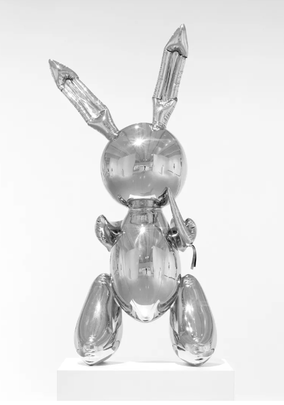

  

    <h1 property="name" id="wb-cont" dir="ltr">Mockups: Canada.ca Content Style Guide refinement project</h1>
    <h2 class="h3 mrgn-tp-lg">Summary of changes (Sprint 7: Dandelion)</h2>
    
<a href="https://trello.com/c/z9U4HVsP" class="btn btn-sm btn-success">Trello: Summary of changes</a>

    <ul>
      <li><a href="sumchanges-en-01.html">More content</a></li>
      <li><a href="sumchanges-en-02.html">Separate link</a></li>
    </ul>
  

  

    

  

