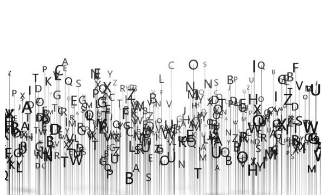

  

    

      <h1 property="name" id="wb-cont" dir="ltr">Canada.ca Content Style Guide</h1>
      
These are the rules to create web content that can be easily found, understood and used. They are based on writing principles and techniques that help make web content clear and adapted to the needs of all people. Use the style guide with the <cite>Canada.ca Content and Information Specification</cite> when you're designing and organizing web content.

      <a href="sumchanges-en-05.html" class="btn btn-lg btn-primary">The Content Style Guide</a>

    

  

  <section class="gc-srvinfo">
    <h2 class="wb-inv">Canada.ca Content Style Guide sections</h2>
    

      

        <h3><a href="sumchanges-en-05.html">The Content Style Guide</a></h3>
        
Purpose, use, summary of changes, and related policies, standards and procedures

      

      

        <h3><a href="sumchanges-en-06.html">List of changes to the Canada.ca Content Style Guide</a></h3>
        
This list begins with changes on December 6, 2023

      

    

  </section>

