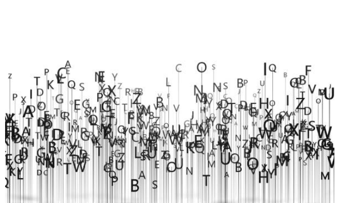

  

    

      <h1 property="name" id="wb-cont" dir="ltr">Canada.ca Content Style Guide</h1>
      
These are the rules to create web content that can be easily found, understood and used. They are based on writing principles and techniques that help make web content clear and adapted to the needs of all people. Use the style guide with the <cite>Canada.ca Content and Information Specification</cite> when you're designing and organizing web content.

    

    

  

  <section class="gc-srvinfo">
    <h2>Sections</h2>
    

      

        <h3><a href="sumchanges-en-15.html">1.0 Writing for the web</a></h3>
        
Tasks, audience (accessibility, usability, readabilty), official languages

      

      

        <h3><a href="sumchanges-en-16.html">2.0 Plain language</a></h3>
        
Plain language

      

      

        <h3><a href="sumchanges-en-17.html">3.0 Tone</a></h3>
        
Direct, formative, conversational, professional

      

      

        <h3><a href="sumchanges-en-18.html">4.0 Style</a></h3>
        
Writing style, punctuation

      

      

        <h3><a href="sumchanges-en-19.html">5.0 Content structure</a></h3>
        
Page title, headings, lists, tables

      

      

        <h3><a href="sumchanges-en-20.html">6.0 Images and videos</a></h3>
        
Functional images, decorative images

      

      

        <h3><a href="sumchanges-en-21.html">7.0 Links</a></h3>
        
Strategic and descriptive links

      

    

    <h2>Case studies</h2>
    

      

        <h3><a href="sumchanges-en-24.html">Case study A</a></h3>
        
Improve plain language and content structure

      

      

        <h3><a href="sumchanges-en-25.html">Case study B</a></h3>
        
Improve and simplify tables

      

    

    <h2>About the guide</h2>
    

      

        <h3><a href="sumchanges-en-14.html">Purpose and Use</a></h3>
        
Purpose and use of the style guide

      

      

        <h3><a href="sumchanges-en-22.html">Policies, standards and procedures</a></h3>
        
Content must comply with

      

      

        <h3><a href="sumchanges-en-23.html">Summary of changes</a></h3>
        
List begins with changes on May 25, 2023

      

      

        <h3><a href="sumchanges-en-26.html">Resources</a></h3>
        
Resources

      

    

  </section>

