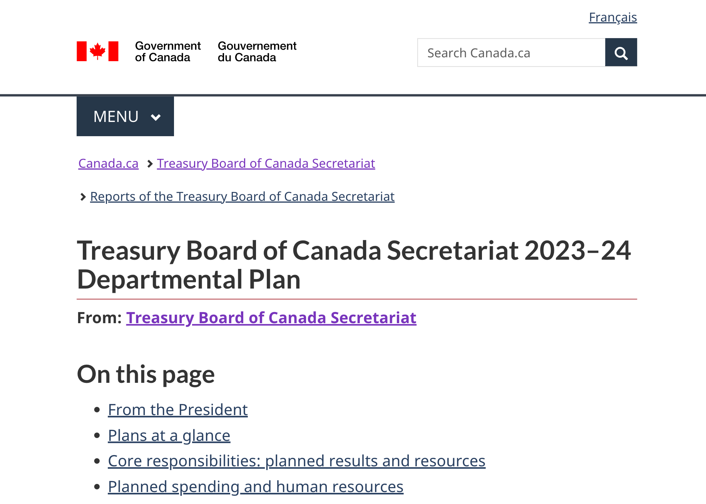

Last updated: August 10, 2023

Optional

Departmental plans describe an institution's spending plan for the next fiscal year.

## On this page

*   [When to use](#when-to-use)
*   [What to avoid](#what-to-avoid)
*   [Content and design](#content-and-design)
*   [How to implement](#how)
*   [Research and rationale](#research)
*   [Latest changes](#latest)

## When to use

*   Use when publishing your institution's departmental plan

## What to avoid

*   Don't use this template for other corporate reporting

  
## Content and design

The departmental plan template consists of 2 layouts:
*   "At a glance" page: provides a summary of key information that is easily consumable for a broad audience
*   Full plan page: provides a detailed breakdown of how the organization is spending and plans to spend on its core responsibilities

<h3>Content specifications</h3>

To come.

<h3>Design specifications</h3>

To come. 

<h3>Visual examples</h3>

To come. 

## How to implement

## Research and rationale

<h3>Research findings</h3>

Research is ongoing to determine the best way to present information contained in the departmental plans in an accessible and user-friendly way. To date, some known issues include non-intuitive headers, repetitive information and overly complex tables.

<h3>Policy rationale</h3>

Insitutions are required to publish departmental plans annually. This template supports a consistent approach to how departmental plans are presented on Canada.ca.

## Latest changes

2023-08-10: Created a two-page layout pattern to target different audiences for departmental plans, including simplified tables, revised wording for headers and reduced the overall length of the plan

