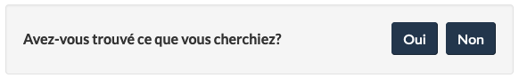
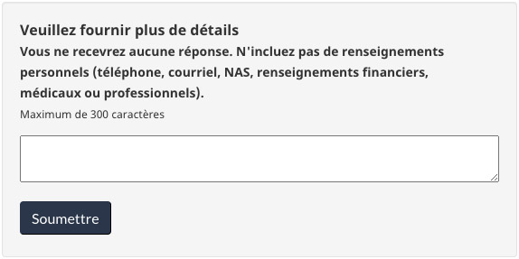
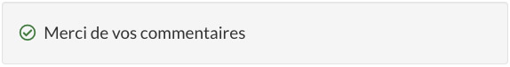

Dernière mise à jour : 28 mars 2023

Facultatif

L’outil de rétroaction est une configuration **facultative** pour recueillir la rétroaction de l’expérience sur une page. Il remplace la configuration « Signaler un problème » tout en recueillant activement la rétroaction des utilisateurs.

## Sur cette page

*   [Quand utiliser cette configuration](#quand-utiliser-cette-configuration)
*   [Quoi éviter](#quoi-éviter)
*   [Contenu et conception](#contenu-et-conception)
*   [Méthode de mise en oeuvre](#méthode)
*   [Recherche et justification](#recherche)
*   [Discussion](#discussion)

## Quand utiliser cette configuration

Envisagez d’utiliser l’outil de rétroaction sur la page pour :

* Découvrir des problèmes propres à la page qui modifient votre note sur le sondage sur la réussite des tâches du gouvernement du Canada (GC).
* Rechercher des problèmes sur des pages que vous prévoyez traiter ultérieurement.
* Déterminer si les pages nouvelles ou existantes répondent aux besoins des utilisateurs.
* Déterminer les problèmes émergents.
* Assurer le suivi des améliorations de la page après leur mise en ligne.

## Quoi éviter

Évitez d’utiliser l’outil de rétroaction sur la page, dans des pages pour lesquelles vous ne prévoyez pas surveiller les commentaires et prendre des mesures. Nous vous déconseillons également d’utiliser l’outil dans des environnements sécurisés.

[Autres comportements à éviter en analysant une rétroaction](https://conception.canada.ca/retroaction/quand.html)

## Contenu et conception

<h3>Exemples visuels</h3>

<h4>1. Première vue de l’outil de rétroaction</h4>

<h4>2. Vue après avoir sélectionné « Non »</h4>

<h4>3. Vue après avoir sélectionné « Oui » ou après avoir soumis la rétroaction</h4>

Outil de rétroaction

Un en-tête portant la mention « Avez-vous trouvé ce que vous cherchiez? », suivi des options de choix « oui » ou « non ».

Un en-tête portant la mention « Veuillez fournir plus de détails », suivi de la formulation « Vous ne recevrez aucune réponse. N’incluez pas de renseignements personnels (téléphone, courriel, NAS, renseignements financiers, médicaux ou professionnels) Maximum de 300 caractères », et d’un champ de texte pour fournir plus de détails.

Un en-tête portant la mention « Merci de votre rétroaction! »

<h3>Spécifications de contenu</h3>

<h4>Interactions</h4>

<strong>Si un utilisateur sélectionne « Non »</strong> à l’invite « Avez-vous trouvé ce que vous cherchiez? », un champ de texte ouvert s’affiche pour inscrire son commentaire. Il commence avec un en-tête portant la mention « Veuillez fournir plus de détails », suivi de la formulation « Vous ne recevrez aucune réponse.
N’incluez pas de renseignements personnels (téléphone, courriel, NAS, renseignements financiers, médicaux ou professionnels) Maximum de 300 caractères ».
Après avoir sélectionné « Soumettre », un message de remerciement s’affiche..

<strong>Si un utilisateur sélectionne « Oui »</strong> à l’invite « Avez-vous trouvé ce que vous cherchiez? », seulement le message de remerciement s’affichera.

<h3>Spécifications de conception</h3>

Le widget de rétroaction remplace la configuration « Signaler un problème » lors de son utilisation.

<h2>Méthode de mise en oeuvre</h2>

Ajoutez-le au bas d’une page de contenu, après le contenu de la page et avant la date de modification. 

<h3>Code de l’outil de rétroaction pour les pages dans Adobe Experience Manager (AEM) </h3>

Utilisez ce code de rétroaction pour toutes les pages hébergées dans le service Web géré par Adobe.

Instructions

<ol class="lst-spcd">

<li>Ajoutez un composant HTML générique au bas du contenu principal. Utilisez le code HTML (ci-dessous) comme référence. Il s’agira de la section « Avez-vous trouvé ce que vous cherchiez? » et « Partagez cette page ».</li>

<li>Mettez à jour les valeurs des champs de saisie masqués, avec les renseignements propres à votre mise en œuvre. Voici l’utilité de ces champs masqués :</li>

    <ul>
    <li>Institution (le sigle de votre ministère) – obligatoire</li>
    <li>Thème – obligatoire</li>
    <li>Section (une section du site Web) – obligatoire, mais elle peut être laissée en blanc</li>
    <li>Titre de la page – obligatoire</li>
    </ul>

<strong>Remarque importante! </strong> Les valeurs associées à l’institution, au thème et à la section doivent être IDENTIQUES en anglais et en français. 

<li>Enregistrez et publiez vos changements!</li>

<li><strong>Exclusivement aux fins des projets pilotes d’apprentissage machine :</strong> Indiquez au Bureau de la transformation numérique (BTN) les adresses URL auxquelles on a ajouté l’outil de rétroaction.</li>

<li><strong>Pour tous les projets pilotes :</strong> Mentionnez au BTN si vous ajoutez une nouvelle section ou un nouveau thème, afin que nous puissions ajouter ces filtres dans la visionneuse de rétroactions.</li>

</ol>

                            

Code

<pre class="prettyprint"><code>

  &lt;div class=&quot;row row-no-gutters mrgn-tp-xl&quot;&gt;
      &lt;div class=&quot;col-sm-7 col-lg-6&quot;&gt;
          &lt;section class=&quot;gc-pg-hlpfl provisional&quot;&gt;
              &lt;div class=&quot;well mrgn-bttm-0&quot;&gt;
                  &lt;form id=&quot;gc-pg-hlpfl-frm&quot; action=&quot;/gc/services/generateemail&quot; method=&quot;post&quot; autocomplete=&quot;off&quot; class=&quot;provisional wb-postback&quot; data-wb-postback=&quot;{&quot;success&quot;:&quot;.gc-pg-hlpfl-thnk&quot;,&quot;content&quot;:&quot;#gc-pg-hlpfl-frm&quot;}&quot;&gt;
  &lt;input type=&quot;hidden&quot; name=&quot;institutionopt&quot; value=&quot;Institution - obligatoire - doit utiliser la même valeur d'acronyme EN et FR&quot;&gt;
  &lt;input type=&quot;hidden&quot; name=&quot;themeopt&quot; value=&quot;Thème - obligatoire - doit utiliser la même valeur EN et FR&quot;&gt;
  &lt;input type=&quot;hidden&quot; name=&quot;sectionopt&quot; value=&quot;Section - obligatoire mais peut être vide - même valeur EN et FR&quot;&gt;
  &lt;input type=&quot;hidden&quot; name=&quot;pageTitle&quot; value=&quot;Titre de la page (FR) - obligatoire&quot;&gt;
                  &lt;input type=&quot;hidden&quot; name=&quot;emailTemplate&quot; value=&quot;servcan/gc-pagesuccessen&quot;&gt;
                      &lt;div class=&quot;gc-pg-hlpfl-btn&quot;&gt;
                          &lt;div class=&quot;row row-no-gutters&quot;&gt;
                              &lt;div class=&quot;col-xs-12 col-sm-7 mrgn-tp-sm&quot;&gt;
                                  &lt;h2 class=&quot;mrgn-tp-sm h5&quot;&gt;Avez-vous trouvé ce que vous cherchiez?&lt;/h2&gt;
                              &lt;/div&gt;
                              &lt;div class=&quot;col-xs-8 col-sm-5 text-right&quot;&gt;
                                  &lt;button type=&quot;submit&quot; name=&quot;helpful&quot; value=&quot;Yes&quot; class=&quot;btn btn-primary&quot; data-gc-analytics-wtph&gt;Oui&lt;/button&gt;
                                  &lt;button type=&quot;button&quot; class=&quot;btn btn-primary mrgn-lft-sm nojs-hide&quot; data-wb-doaction=&quot;[                                    {&quot;action&quot;:&quot;removeClass&quot;,&quot;source&quot;:&quot;.gc-pg-hlpfl-no&quot;,&quot;class&quot;:&quot;nojs-show&quot;},
                                      {&quot;action&quot;:&quot;addClass&quot;,&quot;source&quot;:&quot;.gc-pg-hlpfl-btn&quot;,&quot;class&quot;:&quot;hide&quot;}
                                  ]&quot; data-gc-analytics-wtph-no&gt;Non&lt;/button&gt;
                              &lt;/div&gt;
                          &lt;/div&gt;
                      &lt;/div&gt;
                      &lt;p class=&quot;h3 hidden nojs-show&quot;&gt;Sinon, dites nous pourquoi&nbsp;:&lt;/p&gt;
                      &lt;div class=&quot;gc-pg-hlpfl-no nojs-show&quot;&gt;
                          &lt;fieldset&gt;
                              &lt;legend class=&quot;h4 mrgn-tp-0 mrgn-bttm-md&quot;&gt;Qu’est-ce qui n’allait pas?&lt;/legend&gt;

  &lt;div class=&quot;radio&quot;&gt;
  &lt;label for=&quot;problem1&quot;&gt;
  &lt;input name=&quot;problem&quot; id=&quot;problem1&quot; type=&quot;radio&quot; value=&quot;Je ne peux pas trouver l’information&quot; data-gc-analytics-wtph-value=&quot;I can't find the information-Je ne peux pas trouver l'information&quot; data-gc-analytics-collect=&quot;notPrivate&quot;&gt;Je ne peux pas &lt;strong&gt;trouver&lt;/strong&gt; l’information
  &lt;/label&gt;
  &lt;/div&gt;

  &lt;div class=&quot;radio&quot;&gt;
  &lt;label for=&quot;problem2&quot;&gt;
  &lt;input name=&quot;problem&quot; id=&quot;problem2&quot; type=&quot;radio&quot; value=&quot;L'information est difficile à comprendre&quot; data-gc-analytics-wtph-value=&quot;The information is hard to understand-L'information est difficile à comprendre&quot; data-gc-analytics-collect=&quot;notPrivate&quot;&gt; L'information est difficile à  &lt;strong&gt;comprendre&lt;/strong&gt;
  &lt;/label&gt;
  &lt;/div&gt;

  &lt;div class=&quot;radio&quot;&gt;
  &lt;label for=&quot;problem3&quot;&gt;
  &lt;input name=&quot;problem&quot; id=&quot;problem3&quot; type=&quot;radio&quot; value=&quot;Il y avait une erreur / quelque chose ne fonctionnait pas&quot; data-gc-analytics-wtph-value=&quot;There was an error or something didn't work-Il y avait une erreur ou quelque chose ne fonctionnait pas&quot; data-gc-analytics-collect=&quot;notPrivate&quot;&gt; Il y avait une erreur / quelque chose  &lt;strong&gt;ne fonctionnait pas&lt;/strong&gt;
  &lt;/label&gt;
  &lt;/div&gt;
                             &lt;div class=&quot;radio&quot;&gt;
                                  &lt;label for=&quot;problem4&quot;&gt;
                                      &lt;input name=&quot;problem&quot; id=&quot;problem4&quot; type=&quot;radio&quot; value=&quot;Autre raison&quot; data-gc-analytics-wtph-value=&quot;Other reason-Autre raison&quot; data-gc-analytics-collect=&quot;notPrivate&quot;&gt;
                                      Autre raison
                                  &lt;/label&gt;
                             &lt;/div&gt;
                          &lt;/fieldset&gt;
                          &lt;label for=&quot;problem6&quot; class=&quot;mrgn-bttm-0&quot;&gt;Veuillez fournir plus de détails&lt;/label&gt;
                          &lt;p class=&quot;small&quot;&gt;
                              &lt;strong&gt;Vous ne recevrez aucune réponse. N'incluez pas de renseignements personnels (téléphone, courriel, NAS, renseignements financiers, médicaux ou professionnels.&lt;/strong&gt;
                              &lt;br&gt;
                              &lt;span class=&quot;small&quot;&gt;Maximum de 300 caractères&lt;/span&gt;
                          &lt;/p&gt;
                          &lt;textarea id=&quot;problem6&quot; name=&quot;details&quot; class=&quot;full-width&quot; maxlength=&quot;300&quot;&gt;&lt;/textarea&gt;
                          &lt;button type=&quot;submit&quot; name=&quot;helpful&quot; value=&quot;No&quot; class=&quot;btn btn-primary mrgn-tp-md mrgn-bttm-sm&quot; data-gc-analytics-wtph-submit&gt;Soumettre&lt;/button&gt;
                      &lt;/div&gt;
                      &lt;input type=&quot;hidden&quot; name=&quot;problem&quot; value=&quot;&quot;&gt;
                  &lt;/form&gt;
                  &lt;div class=&quot;gc-pg-hlpfl-thnk hide&quot;&gt;
                      &lt;p class=&quot;h6 mrgn-tp-sm mrgn-bttm-sm&quot;&gt;&lt;span class=&quot;far fa-check-circle text-success mrgn-rght-sm&quot; aria-hidden=&quot;true&quot;&gt;&lt;/span&gt; Merci de vos commentaires&lt;/p&gt;
                  &lt;/div&gt;
              &lt;/div&gt;
          &lt;/section&gt;
      &lt;/div&gt;
      &lt;div class=&quot;col-sm-3 col-sm-offset-1 col-lg-offset-3&quot;&gt;
          &lt;div class=&quot;wb-share&quot; data-wb-share=&quot;{&quot;pnlId&quot;:&quot;pnlShrPg&quot;, &quot;lnkClass&quot;: &quot;btn btn-default btn-block mrgn-tp-md&quot;}&quot;&gt;&lt;/div&gt;
      &lt;/div&gt;
  &lt;/div&gt;

</code></pre>

<h3>Code de l’outil de rétroaction pour les pages qui ne sont pas dans Adobe Experience Manager (AEM)</h3>

Utilisez ce code de rétroaction pour toutes les pages qui ne sont pas hébergées dans le service Web géré par Adobe.

Instructions

<ol class="lst-spcd">
<li>Insérez ce code HTML là où se trouvent les formulations « Avez-vous trouvé ce que vous cherchiez? » et « Partagez cette page ».</li>

<li>Mettez à jour les valeurs des champs de saisie masqués, avec les renseignements propres à votre mise en œuvre. Voici l’utilité de ces champs masqués :</li>
<ul>
<li>Institution (le sigle de votre ministère) – obligatoire</li>
<li>Thème – obligatoire</li>
<li>Section (une section du site Web) – obligatoire, mais elle peut être laissée en blanc</li>
<li>Titre de la page – obligatoire</li>
<li>Page de soumission (adresse URL) – obligatoire</li>
<li>Langue de la page (utilisez EN ou FR) – obligatoire</li>
</ul>

<strong>Remarque importante!  </strong> Les valeurs associées à l’institution, au thème et à la section doivent être IDENTIQUES en anglais et en français. 

<li>Ajoutez le JavaScript juste au-dessus du marqueur de fermeture /body</li>

<li>4.	Lorsqu’une personne soumet un commentaire, un crochet et un message de remerciement s’affichent. Si le crochet ne s’affiche pas, il faudra peut-être ajouter une référence à votre catalogue d’icônes Font Awesome dans votre en-tête de page.</li>

<pre class="prettyprint"><code>
&lt;link rel=&quot;stylesheet&quot; href=&quot;https://use.fontawesome.com/releases/v5.8.1/css/all.css&quot; integrity=&quot;sha384-50oBUHEmvpQ+1lW4y57PTFmhCaXp0ML5d60M1M7uH2+nqUivzIebhndOJK28anvf&quot; crossorigin=&quot;anonymous&quot; /&gt;&lt;/li&gt;
 </code></pre>

<li><strong>Exclusivement aux fins des projets pilotes d’apprentissage machine :</strong> Indiquez au Bureau de la transformation numérique (BTN) les adresses URL auxquelles on a ajouté l’outil de rétroaction.</li>

<li><strong>6.	Pour tous les projets pilotes :</strong> Mentionnez au BTN si vous ajoutez une nouvelle section ou un nouveau thème, afin que nous puissions ajouter ces filtres dans la visionneuse de rétroactions.</li>

</ol>

 
Code

 <pre class="prettyprint"><code>
   &lt;!-- START PAGE FEEDBACK WIDGET --&gt;
   &lt;div class=&quot;row row-no-gutters mrgn-tp-xl&quot;&gt;
   &lt;div class=&quot;col-sm-7 col-lg-6&quot;&gt;
      &lt;section class=&quot;gc-pg-hlpfl provisional&quot;&gt;
         &lt;div class=&quot;well mrgn-bttm-0&quot;&gt;
            &lt;form id=&quot;gc-pg-hlpfl-frm&quot; action=&quot;#&quot; method=&quot;post&quot; autocomplete=&quot;off&quot;&gt;
               &lt;input type=&quot;hidden&quot; name=&quot;institutionopt&quot; value=&quot;Acronyme de l'institution - obligatoire - doit utiliser la même valeur EN et FR&quot;&gt;
               &lt;input type=&quot;hidden&quot; name=&quot;themeopt&quot; value=&quot;Thème - obligatoire - doit utiliser la même valeur EN et FR&quot;&gt;
               &lt;input type=&quot;hidden&quot; name=&quot;language&quot; value=&quot;Langue - obligatoire - utiliser EN ou FR&quot;&gt;
               &lt;input type=&quot;hidden&quot; name=&quot;pageTitle&quot; value=&quot;Titre de la page FR - obligatoire&quot;&gt;
               &lt;input type=&quot;hidden&quot; name=&quot;submissionPage&quot; value=&quot;URL de la page - obligatoire&quot;&gt;
               &lt;input type=&quot;hidden&quot; name=&quot;sectionopt&quot; value=&quot;Section - obligatoire mais peut être vide - doit utiliser la même valeur EN et FR&quot;&gt;
               &lt;input type=&quot;hidden&quot; id=&quot;helpful&quot; name=&quot;helpful&quot; value=&quot;Yes&quot;&gt;
               &lt;div class=&quot;gc-pg-hlpfl-btn&quot;&gt;
                  &lt;div class=&quot;row row-no-gutters&quot;&gt;
                     &lt;div class=&quot;col-xs-12 col-sm-7 mrgn-tp-sm&quot;&gt;
                        &lt;h2 class=&quot;mrgn-tp-sm h5&quot;&gt;Avez-vous trouvé ce que vous cherchiez?&lt;/h2&gt;
                     &lt;/div&gt;
                     &lt;div class=&quot;col-xs-8 col-sm-5 text-right&quot;&gt;
                        &lt;button id=&quot;btnyes&quot; type=&quot;submit&quot; value=&quot;Yes&quot; class=&quot;btn btn-primary&quot;&gt;Oui&lt;/button&gt;
                        &lt;button id=&quot;btnno&quot; type=&quot;button&quot; class=&quot;btn btn-primary mrgn-lft-sm nojs-hide&quot;&gt;Non&lt;/button&gt;
                     &lt;/div&gt;
                  &lt;/div&gt;
               &lt;/div&gt;
               &lt;p class=&quot;h3 hidden nojs-show&quot;&gt;Sinon, dites nous pourquoi&nbsp;:&lt;/p&gt;
               &lt;div class=&quot;gc-pg-hlpfl-no nojs-show&quot;&gt;
                  &lt;fieldset&gt;
                     &lt;legend class=&quot;h4 mrgn-tp-0 mrgn-bttm-md&quot;&gt;Qu’est-ce qui n’allait pas?&lt;/legend&gt;
                     &lt;div class=&quot;radio&quot;&gt;
                        &lt;label for=&quot;problem1&quot;&gt;
                        &lt;input name=&quot;problem&quot; id=&quot;problem1&quot; type=&quot;radio&quot; value=&quot;Je ne peux pas trouver l’information&quot; data-gc-analytics-wtph-value=&quot;I can't find the information-Je ne peux pas trouver l'information&quot; data-gc-analytics-collect=&quot;notPrivate&quot;&gt;
                        Je ne peux pas &lt;strong&gt;trouver&lt;/strong&gt; l’information
                        &lt;/label&gt;
                     &lt;/div&gt;
                     &lt;div class=&quot;radio&quot;&gt;
                        &lt;label for=&quot;problem2&quot;&gt;
                        &lt;input name=&quot;problem&quot; id=&quot;problem2&quot; type=&quot;radio&quot; value=&quot;L'information est difficile à comprendre&quot; data-gc-analytics-wtph-value=&quot;The information is hard to understand-L'information est difficile à comprendre&quot; data-gc-analytics-collect=&quot;notPrivate&quot;&gt;
                        L'information est difficile à &lt;strong&gt;comprendre&lt;/strong&gt;
                        &lt;/label&gt;
                     &lt;/div&gt;
                     &lt;div class=&quot;radio&quot;&gt;
                        &lt;label for=&quot;problem3&quot;&gt;
                        &lt;input name=&quot;problem&quot; id=&quot;problem3&quot; type=&quot;radio&quot; value=&quot;Il y avait une erreur / quelque chose ne fonctionnait pas&quot; data-gc-analytics-wtph-value=&quot;There was an error or something didn't work-Il y avait une erreur ou quelque chose ne fonctionnait pas&quot; data-gc-analytics-collect=&quot;notPrivate&quot;&gt;
                        Il y avait une erreur / quelque chose &lt;strong&gt;ne fonctionnait pas&lt;/strong&gt;
                        &lt;/label&gt;
                     &lt;/div&gt;
                     &lt;div class=&quot;radio&quot;&gt;
                        &lt;label for=&quot;problem4&quot;&gt;
                        &lt;input name=&quot;problem&quot; id=&quot;problem4&quot; type=&quot;radio&quot; value=&quot;Autre raison&quot; data-gc-analytics-wtph-value=&quot;Other reason-Autre raison&quot; data-gc-analytics-collect=&quot;notPrivate&quot;&gt;
                        Autre raison
                        &lt;/label&gt;
                     &lt;/div&gt;
                  &lt;/fieldset&gt;
                  &lt;label for=&quot;problem6&quot; class=&quot;mrgn-bttm-0&quot;&gt;Veuillez fournir plus de détails&lt;/label&gt;
                  &lt;p class=&quot;small&quot;&gt;
                     &lt;strong&gt;Vous ne recevrez aucune réponse. N'incluez pas de renseignements personnels (téléphone, courriel, NAS, renseignements financiers, médicaux ou professionnels)&lt;/strong&gt;
                     &lt;br&gt;
                     &lt;span class=&quot;small&quot;&gt;Maximum de 300 caractères&lt;/span&gt;
                  &lt;/p&gt;
                  &lt;textarea id=&quot;problem6&quot; name=&quot;details&quot; class=&quot;full-width&quot; maxlength=&quot;300&quot;&gt;&lt;/textarea&gt;
                  &lt;button type=&quot;submit&quot; value=&quot;No&quot; class=&quot;btn btn-primary mrgn-tp-md mrgn-bttm-sm&quot;&gt;Soumettre&lt;/button&gt;
               &lt;/div&gt;
            &lt;/form&gt;
            &lt;div class=&quot;gc-pg-hlpfl-thnk hide&quot;&gt;
               &lt;p class=&quot;h6 mrgn-tp-sm mrgn-bttm-sm&quot;&gt;&lt;span class=&quot;far fa-check-circle text-success mrgn-rght-sm&quot; aria-hidden=&quot;true&quot;&gt;&lt;/span&gt; Merci de vos commentaires&lt;/p&gt;
            &lt;/div&gt;
         &lt;/div&gt;
      &lt;/section&gt;
   &lt;/div&gt;
   &lt;div class=&quot;col-sm-3 col-sm-offset-1 col-lg-offset-3&quot;&gt;
      &lt;div class=&quot;wb-share&quot; data-wb-share=&quot;{&quot;pnlId&quot;:&quot;pnlShrPg&quot;, &quot;lnkClass&quot;: &quot;btn btn-default btn-block mrgn-tp-md&quot;}&quot;&gt;&lt;/div&gt;
   &lt;/div&gt;
   &lt;/div&gt;
   &lt;!-- END PAGE FEEDBACK WIDGET --&gt;
   &lt;!-- START SCRIPT PAGE FEEDBACK WIDGET --&gt;
   &lt;script&gt;
   $(document).on(&quot;wb-ready.wb&quot;, function() {
      $(&quot;#btnno&quot;).click(function(e) {
          $(&quot;.gc-pg-hlpfl-no&quot;).removeClass(&quot;nojs-show&quot;);
          $(&quot;.gc-pg-hlpfl-btn&quot;).addClass(&quot;hide&quot;);
          $(&quot;#helpful&quot;).val(&quot;No&quot;);
      });
      $(&quot;#gc-pg-hlpfl-frm&quot;).submit(function(e) {
          e.preventDefault();
          $(&quot;.gc-pg-hlpfl-thnk&quot;).removeClass(&quot;hide&quot;);
          $(&quot;#gc-pg-hlpfl-frm&quot;).addClass(&quot;hide nojs-show&quot;);
          $.ajax({
              url: 'https://pagesuccessemailqueue.azurewebsites.net/api/QueueProblemForm',
              type: 'POST',
              dataType: 'text',
              data: $('form#gc-pg-hlpfl-frm').serialize(),
              success: function(data) {},
              error: function(xhr, status, err) {
                  console.log(xhr.responseText);
              }
          });
      });
   });
   &lt;/script&gt;
   &lt;!-- END SCRIPT PAGE FEEDBACK WIDGET --&gt;

 </code></pre>
 

                  

            

<h3 id="analyser">Accéder et analyser une rétroaction</h3>

Il est possible d’afficher une rétroaction et de la télécharger en format CSV ou Excel, à tout moment, au moyen du site Web de la visionneuse de rétroactions.

La visionneuse de rétroactions est un environnement protégé par un mot de passe disponible pour tous ceux qui participent à la rétroaction sur la page. Communiquez avec le BTN afin d’accéder au site.

Courriel : <a href="mailto:dto.btn@tbs-sct.gc.ca">dto.btn@tbs-sct.gc.ca</a>

<a href="https://conception.canada.ca/retroaction/index.html">Document d’orientation complet sur l’utilisation de l’outil de rétroaction sur la page et l’analyse connexe</a> 

<h2>Recherche et justification</h2>

<h3>Résultats de recherche</h3>

<a href="https://blogue.canada.ca/2020/10/09/recueillir-la-retroaction.html">Billet de blogue : Recueillir la rétroaction, trouver les problèmes</a>

<h3>Justification stratégique</h3>

La <cite>Ligne directrice sur les services et le numérique</cite> exige que <a href="https://www.canada.ca/fr/gouvernement/systeme/gouvernement-numerique/ligne-directrice-services-numerique.html#ToC2_2">la rétroaction des clients</a> fasse partie intégrante de la conception des services et des produits. Celle-ci peut prendre plusieurs formes, y compris au moyen de l’outil de rétroaction sur la page.

<h2>Discussion</h2>
<ul>

<li><a href="mailto:dto.btn@tbs-sct.gc.ca">Envoyez un courriel au Bureau de la transformation numérique</a></li>
</ul>
