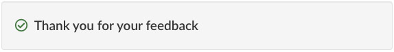

Last updated: October 4, 2023

Optional

The feedback tool is an **optional** pattern to collect feedback on the page experience. It replaces the “Report a problem” pattern while actively collecting user feedback.

## On this page

*   [When to use](#when-to-use)
*   [What to avoid](#what-to-avoid)
*   [Content and design](#content-and-design)
*   [How to implement](#how)
*   [Research and rationale](#research)
*   [Discussion](#discussion)

## When to use

Consider adding the page feedback tool to:

*   uncover specific page-level issues affecting your GC Task Success Survey task score
*   research issues on pages you plan on working on in the future
*   understand if new or existing pages are meeting user needs
*   identify emerging issues
*   monitor after page improvements have gone live

## What to avoid

Avoid using the page feedback tool on pages where there is no plan to monitor comments or take action. We also don’t recommend using the tool within secure spaces.

[Additional behaviours to avoid when analyzing feedback](https://design.canada.ca/feedback/when.html#how-not-to-use-the-tool)

## Content and design

<h3>Visual examples</h3>

<h4>1. Initial view of the feedback tool</h4>

<h4>2a. View after selecting "No"</h4>

<h4>2b. View after selecting "No" with contact option</h4>
The expando labeled “Need urgent help with a problem? Contact us” will be closed by default.

<h4>3. View after selecting "Yes" or after submitting feedback</h4>

Feedback tool

A heading labelled "Did you find what you were looking for?", followed by options to select yes or no.

A heading labelled "Please provide more details", followed by the text "You will not receive a reply.
Don't include personal information (telephone, email, SIN, financial, medical, or work details).
Maximum 300 characters", and a text field to provide more details.

A heading labelled "Thank you for your feedback"

<h3>Content specifications</h3>

Optional Contact link

If using the contact link option, the link can go to an HTML page or an email address.

Keep the link text short and aim for the format “Contact [the Service Name]”

<h4>Interactions</h4>

<strong>If a user selects "No"</strong> they will be shown an open text field to enter their comment.

The open text field begins with a heading labelled "Please provide more details", followed by the text "You will not receive a reply.
Don't include personal information (telephone, email, SIN, financial, medical, or work details).
Maximum 300 characters". After selecting "Submit", the user is shown a thank you message.

If the contact option is used, a contact link for the service is placed inside an expando labeled “Need urgent help with a problem? Contact us”.

<strong>If a user selects "Yes"</strong> they will only be shown a thank you message.

<h3>Design specifications</h3>

The feedback widget replaces the "Report a problem" pattern when in use.

Optional Contact link

Consider adding a contact link in the page feedback tool if:

<ul>
<li>users are trying to use the feedback tool as a method to get a response from the government</li>
<li>you have tried to make the page content clearer for how to contact the program or service and users are still using the feedback tool to get a response for their situation<li>
</ul>

<h2>How to implement</h2>

Add it to the bottom of a content page after the page content and before the date modified. 

<h3>Feedback tool for AEM pages</h3>

Use these instructions for any page hosted on the Adobe Managed Web Service.

Instructions

<ol class="lst-spcd">

<li><a href="">How to add the feedback component to your page in AEM</a>. (Internal only on GCPedia) </li>

<li>Optional but recommended Add a theme hidden value in the feedback code.  

In most cases, you should include the Canada.ca theme for your content (full list below). This is useful when you want to download feedback for an entire theme of pages at the same time.  

This is a unilingual value - enter the same theme value to your English and French pages.

If you would like to add a new theme value that is not currently in the Feedback Viewer, contact the Canada Digital Service. We will add the new theme value into the Feedback Viewer.  

Canada.ca themes

<ul>
<li>About Gov</li>
<li>Benefits</li>
<li>Business</li>
<li>CanadaTheWorld</li>
<li>Culture</li>
<li>Defense</li>
<li>Environment</li>
<li>Health</li>
<li>Immigration</li>
<li>Indigenous</li>
<li>Jobs</li>
<li>Money</li>
<li>Policing</li>
<li>PublicService</li>
<li>Science</li>
<li>Taxes</li>
<li>Transport</li>
<li>Travel</li>
<li>Veterans</li>
</ul>

</li>

<li>Optional but recommended Add a “Section” hidden value in the feedback code.   

Consider including this value when you are adding the feedback tool to multiple pages on the same topic, such as “passports” or “employment insurance”.  This is useful when you want to download feedback for multiple pages at the same time.   

This is a unilingual value - enter the same section value to your English and French pages.  

If you would like to add a new section value that is not currently in the Feedback Viewer, contact the Canada Digital Service. We will add the new section value into the Feedback Viewer.

</li>

<li>Optional Contact link  </li>

Consider adding a contact link if:
<ul>
<li>Users are trying to use the feedback tool as a method to get a response from the government</li>
<li>You have tried to make the page content clearer for how to contact the program or service and users are still using the feedback tool to get a response for their situation.</li>
</ul>

</ol>

                            

Code

<pre class="prettyprint"><code>
  &lt;div class=&quot;row row-no-gutters mrgn-tp-xl&quot;&gt;
      &lt;div class=&quot;col-sm-7 col-lg-6&quot;&gt;
          &lt;section class=&quot;gc-pg-hlpfl provisional&quot;&gt;
              &lt;div class=&quot;well mrgn-bttm-0&quot;&gt;
                  &lt;form id=&quot;gc-pg-hlpfl-frm&quot; action=&quot;/gc/services/generateemail&quot; method=&quot;post&quot; autocomplete=&quot;off&quot; class=&quot;provisional wb-postback&quot; data-wb-postback=&quot;{&quot;success&quot;:&quot;.gc-pg-hlpfl-thnk&quot;,&quot;content&quot;:&quot;#gc-pg-hlpfl-frm&quot;}&quot;&gt;
  &lt;input type=&quot;hidden&quot; name=&quot;institutionopt&quot; value=&quot;Institution - required - must use same acronym value EN and FR&quot;&gt;
  &lt;input type=&quot;hidden&quot; name=&quot;themeopt&quot; value=&quot;Theme - required - must use same value EN and FR&quot;&gt;
  &lt;input type=&quot;hidden&quot; name=&quot;sectionopt&quot; value=&quot;Section - required but can be blank - same value EN and FR&quot;&gt;
  &lt;input type=&quot;hidden&quot; name=&quot;pageTitle&quot; value=&quot;Page title (EN) - required&quot;&gt;
                  &lt;input type=&quot;hidden&quot; name=&quot;emailTemplate&quot; value=&quot;servcan/gc-pagesuccessen&quot;&gt;
                      &lt;div class=&quot;gc-pg-hlpfl-btn&quot;&gt;
                          &lt;div class=&quot;row row-no-gutters&quot;&gt;
                              &lt;div class=&quot;col-xs-12 col-sm-7 mrgn-tp-sm&quot;&gt;
                                  &lt;h2 class=&quot;mrgn-tp-sm h5&quot;&gt;Did you find what you were looking for?&lt;/h2&gt;
                              &lt;/div&gt;
                              &lt;div class=&quot;col-xs-8 col-sm-5 text-right&quot;&gt;
                                  &lt;button type=&quot;submit&quot; name=&quot;helpful&quot; value=&quot;Yes&quot; class=&quot;btn btn-primary&quot; data-gc-analytics-wtph&gt;Yes&lt;/button&gt;
                                  &lt;button type=&quot;button&quot; class=&quot;btn btn-primary mrgn-lft-sm nojs-hide&quot; data-wb-doaction=&quot;[                                    {&quot;action&quot;:&quot;removeClass&quot;,&quot;source&quot;:&quot;.gc-pg-hlpfl-no&quot;,&quot;class&quot;:&quot;nojs-show&quot;},
                                      {&quot;action&quot;:&quot;addClass&quot;,&quot;source&quot;:&quot;.gc-pg-hlpfl-btn&quot;,&quot;class&quot;:&quot;hide&quot;}
                                  ]&quot; data-gc-analytics-wtph-no&gt;No&lt;/button&gt;
                              &lt;/div&gt;
                          &lt;/div&gt;
                      &lt;/div&gt;
                      &lt;p class=&quot;h3 hidden nojs-show&quot;&gt;If not, tell us why:&lt;/p&gt;
                      &lt;div class=&quot;gc-pg-hlpfl-no nojs-show&quot;&gt;
                          &lt;fieldset&gt;
                              &lt;legend class=&quot;h4 mrgn-tp-0 mrgn-bttm-md&quot;&gt;What was wrong?&lt;/legend&gt;

  &lt;div class=&quot;radio&quot;&gt;
  &lt;label for=&quot;problem1&quot;&gt;
  &lt;input name=&quot;problem&quot; id=&quot;problem1&quot; type=&quot;radio&quot; value=&quot;I can't find the information&quot; data-gc-analytics-wtph-value=&quot;I can't find the information-Je ne peux pas trouver l'information&quot; data-gc-analytics-collect=&quot;notPrivate&quot;&gt;I can't &lt;strong&gt;find&lt;/strong&gt; the information
  &lt;/label&gt;
  &lt;/div&gt;

  &lt;div class=&quot;radio&quot;&gt;
  &lt;label for=&quot;problem2&quot;&gt;
  &lt;input name=&quot;problem&quot; id=&quot;problem2&quot; type=&quot;radio&quot; value=&quot;The information is hard to understand&quot; data-gc-analytics-wtph-value=&quot;The information is hard to understand-L'information est difficile à comprendre&quot; data-gc-analytics-collect=&quot;notPrivate&quot;&gt; The information is hard to &lt;strong&gt;understand&lt;/strong&gt;
  &lt;/label&gt;
  &lt;/div&gt;

  &lt;div class=&quot;radio&quot;&gt;
  &lt;label for=&quot;problem3&quot;&gt;
  &lt;input name=&quot;problem&quot; id=&quot;problem3&quot; type=&quot;radio&quot; value=&quot;There was an error / something didn't work&quot; data-gc-analytics-wtph-value=&quot;There was an error or something didn't work-Il y avait une erreur ou quelque chose ne fonctionnait pas&quot; data-gc-analytics-collect=&quot;notPrivate&quot;&gt; There was an error or something &lt;strong&gt;didn't work&lt;/strong&gt;
  &lt;/label&gt;
  &lt;/div&gt;
                             &lt;div class=&quot;radio&quot;&gt;
                                  &lt;label for=&quot;problem4&quot;&gt;
                                      &lt;input name=&quot;problem&quot; id=&quot;problem4&quot; type=&quot;radio&quot; value=&quot;Other reason&quot; data-gc-analytics-wtph-value=&quot;Other reason-Autre raison&quot; data-gc-analytics-collect=&quot;notPrivate&quot;&gt;
                                      Other reason
                                  &lt;/label&gt;
                             &lt;/div&gt;
                          &lt;/fieldset&gt;
                          &lt;label for=&quot;problem6&quot; class=&quot;mrgn-bttm-0&quot;&gt;Please provide more details&lt;/label&gt;
                          &lt;p class=&quot;small&quot;&gt;
                              &lt;strong&gt;You will not receive a reply. Don't include personal information (telephone, email, SIN, financial, medical, or work details).&lt;/strong&gt;
                              &lt;br&gt;
                              &lt;span class=&quot;small&quot;&gt;Maximum 300 characters&lt;/span&gt;
                          &lt;/p&gt;
                          &lt;textarea id=&quot;problem6&quot; name=&quot;details&quot; class=&quot;full-width&quot; maxlength=&quot;300&quot;&gt;&lt;/textarea&gt;
                          &lt;button type=&quot;submit&quot; name=&quot;helpful&quot; value=&quot;No&quot; class=&quot;btn btn-primary mrgn-tp-md mrgn-bttm-sm&quot; data-gc-analytics-wtph-submit&gt;Submit&lt;/button&gt;
                      &lt;/div&gt;
                      &lt;input type=&quot;hidden&quot; name=&quot;problem&quot; value=&quot;&quot;&gt;
                  &lt;/form&gt;
                  &lt;div class=&quot;gc-pg-hlpfl-thnk hide&quot;&gt;
                      &lt;p class=&quot;h6 mrgn-tp-sm mrgn-bttm-sm&quot;&gt;&lt;span class=&quot;far fa-check-circle text-success mrgn-rght-sm&quot; aria-hidden=&quot;true&quot;&gt;&lt;/span&gt; Thank you for your feedback&lt;/p&gt;
                  &lt;/div&gt;
              &lt;/div&gt;
          &lt;/section&gt;
      &lt;/div&gt;
      &lt;div class=&quot;col-sm-3 col-sm-offset-1 col-lg-offset-3&quot;&gt;
          &lt;div class=&quot;wb-share&quot; data-wb-share=&quot;{&quot;pnlId&quot;:&quot;pnlShrPg&quot;, &quot;lnkClass&quot;: &quot;btn btn-default btn-block mrgn-tp-md&quot;}&quot;&gt;&lt;/div&gt;
      &lt;/div&gt;
  &lt;/div&gt;

</code></pre>

<h3>Feedback tool code for non-AEM pages</h3>

Use this feedback tool code for any page that is not hosted on the Adobe Managed Web Service.

Instructions

<ol class="lst-spcd">
<li>Insert this HTML code where the  “Did you find what you were looking for?” and “Share this page” are located.</li>

<li>Update the values of the hidden input  fields with the information specific to your implementation.  These hidden fields are for:</li>
<ul>
<li>Institution (your department acronym) - required</li>
<li>Theme - required</li>
<li>Section (a section of your website) - required but can be left blank</li>
<li>Page title - required</li>
<li>Submission page (URL) - required</li>
<li>Page language (Use EN or FR) - required</li>
</ul>

<strong>Important note! </strong>Institution, Theme, Section values should be the SAME in English and French.

<li>Add the Javascript just above the closing /body tag</li>

<li>When someone submits a comment, they will see a checkmark icon and a thank you message.  If you do not see a checkmark, you may need to include a reference to the Font Awesome icon catalog in your page header.</li>

<pre class="prettyprint"><code>
&lt;link rel=&quot;stylesheet&quot; href=&quot;https://use.fontawesome.com/releases/v5.8.1/css/all.css&quot; integrity=&quot;sha384-50oBUHEmvpQ+1lW4y57PTFmhCaXp0ML5d60M1M7uH2+nqUivzIebhndOJK28anvf&quot; crossorigin=&quot;anonymous&quot; /&gt;&lt;/li&gt;
 </code></pre>

<li><strong>For machine learning pilots only:</strong> Tell the DTO the URLS that the feedback tool has been added to.</li>

<li><strong>For all pilots:</strong> Tell the DTO if you are adding a new section or theme, so we can add these filters into the Feedback Viewer.</li>

</ol>

 
Code

 <pre class="prettyprint"><code>
   &lt;!-- START PAGE FEEDBACK WIDGET --&gt;
   &lt;div class=&quot;row row-no-gutters mrgn-tp-xl&quot;&gt;
   &lt;div class=&quot;col-sm-7 col-lg-6&quot;&gt;
      &lt;section class=&quot;gc-pg-hlpfl provisional&quot;&gt;
         &lt;div class=&quot;well mrgn-bttm-0&quot;&gt;
            &lt;form id=&quot;gc-pg-hlpfl-frm&quot; action=&quot;#&quot; method=&quot;post&quot; autocomplete=&quot;off&quot;&gt;
               &lt;input type=&quot;hidden&quot; name=&quot;institutionopt&quot; value=&quot;Institution acronym - required - must use same value EN and FR&quot;&gt;
               &lt;input type=&quot;hidden&quot; name=&quot;themeopt&quot; value=&quot;Theme - required - must use same value EN and FR&quot;&gt;
               &lt;input type=&quot;hidden&quot; name=&quot;language&quot; value=&quot;Language - required - use EN or FR&quot;&gt;
               &lt;input type=&quot;hidden&quot; name=&quot;pageTitle&quot; value=&quot;Page title EN - required&quot;&gt;
               &lt;input type=&quot;hidden&quot; name=&quot;submissionPage&quot; value=&quot;Page URL - required&quot;&gt;
               &lt;input type=&quot;hidden&quot; name=&quot;sectionopt&quot; value=&quot;Section - required but can be blank - must use same value EN and FR&quot;&gt;
               &lt;input type=&quot;hidden&quot; id=&quot;helpful&quot; name=&quot;helpful&quot; value=&quot;Yes&quot;&gt;
               &lt;div class=&quot;gc-pg-hlpfl-btn&quot;&gt;
                  &lt;div class=&quot;row row-no-gutters&quot;&gt;
                     &lt;div class=&quot;col-xs-12 col-sm-7 mrgn-tp-sm&quot;&gt;
                        &lt;h2 class=&quot;mrgn-tp-sm h5&quot;&gt;Did you find what you were looking for?&lt;/h2&gt;
                     &lt;/div&gt;
                     &lt;div class=&quot;col-xs-8 col-sm-5 text-right&quot;&gt;
                        &lt;button id=&quot;btnyes&quot; type=&quot;submit&quot; value=&quot;Yes&quot; class=&quot;btn btn-primary&quot;&gt;Yes&lt;/button&gt;
                        &lt;button id=&quot;btnno&quot; type=&quot;button&quot; class=&quot;btn btn-primary mrgn-lft-sm nojs-hide&quot;&gt;No&lt;/button&gt;
                     &lt;/div&gt;
                  &lt;/div&gt;
               &lt;/div&gt;
               &lt;p class=&quot;h3 hidden nojs-show&quot;&gt;If not, tell us why:&lt;/p&gt;
               &lt;div class=&quot;gc-pg-hlpfl-no nojs-show&quot;&gt;
                  &lt;fieldset&gt;
                     &lt;legend class=&quot;h4 mrgn-tp-0 mrgn-bttm-md&quot;&gt;What was wrong?&lt;/legend&gt;
                     &lt;div class=&quot;radio&quot;&gt;
                        &lt;label for=&quot;problem1&quot;&gt;
                        &lt;input name=&quot;problem&quot; id=&quot;problem1&quot; type=&quot;radio&quot; value=&quot;I can't find the information&quot; data-gc-analytics-wtph-value=&quot;I can't find the information-Je ne peux pas trouver l'information&quot; data-gc-analytics-collect=&quot;notPrivate&quot;&gt;
                        I can't &lt;strong&gt;find&lt;/strong&gt; the information
                        &lt;/label&gt;
                     &lt;/div&gt;
                     &lt;div class=&quot;radio&quot;&gt;
                        &lt;label for=&quot;problem2&quot;&gt;
                        &lt;input name=&quot;problem&quot; id=&quot;problem2&quot; type=&quot;radio&quot; value=&quot;The information is hard to understand&quot; data-gc-analytics-wtph-value=&quot;The information is hard to understand-L'information est difficile à comprendre&quot; data-gc-analytics-collect=&quot;notPrivate&quot;&gt;
                        The information is hard to &lt;strong&gt;understand&lt;/strong&gt;
                        &lt;/label&gt;
                     &lt;/div&gt;
                     &lt;div class=&quot;radio&quot;&gt;
                        &lt;label for=&quot;problem3&quot;&gt;
                        &lt;input name=&quot;problem&quot; id=&quot;problem3&quot; type=&quot;radio&quot; value=&quot;There was an error / something didn't work&quot; data-gc-analytics-wtph-value=&quot;There was an error or something didn't work-Il y avait une erreur ou quelque chose ne fonctionnait pas&quot; data-gc-analytics-collect=&quot;notPrivate&quot;&gt;
                        There was an error or something &lt;strong&gt;didn't work&lt;/strong&gt;
                        &lt;/label&gt;
                     &lt;/div&gt;
                     &lt;div class=&quot;radio&quot;&gt;
                        &lt;label for=&quot;problem4&quot;&gt;
                        &lt;input name=&quot;problem&quot; id=&quot;problem4&quot; type=&quot;radio&quot; value=&quot;Other reason&quot; data-gc-analytics-wtph-value=&quot;Other reason-Autre raison&quot; data-gc-analytics-collect=&quot;notPrivate&quot;&gt;
                        Other reason
                        &lt;/label&gt;
                     &lt;/div&gt;
                  &lt;/fieldset&gt;
                  &lt;label for=&quot;problem6&quot; class=&quot;mrgn-bttm-0&quot;&gt;Please provide more details&lt;/label&gt;
                  &lt;p class=&quot;small&quot;&gt;
                     &lt;strong&gt;You will not receive a reply. Don't include personal information (telephone, email, SIN, financial, medical, or work details).&lt;/strong&gt;
                     &lt;br&gt;
                     &lt;span class=&quot;small&quot;&gt;Maximum 300 characters&lt;/span&gt;
                  &lt;/p&gt;
                  &lt;textarea id=&quot;problem6&quot; name=&quot;details&quot; class=&quot;full-width&quot; maxlength=&quot;300&quot;&gt;&lt;/textarea&gt;
                  &lt;button type=&quot;submit&quot; value=&quot;No&quot; class=&quot;btn btn-primary mrgn-tp-md mrgn-bttm-sm&quot;&gt;Submit&lt;/button&gt;
               &lt;/div&gt;
            &lt;/form&gt;
            &lt;div class=&quot;gc-pg-hlpfl-thnk hide&quot;&gt;
               &lt;p class=&quot;h6 mrgn-tp-sm mrgn-bttm-sm&quot;&gt;&lt;span class=&quot;far fa-check-circle text-success mrgn-rght-sm&quot; aria-hidden=&quot;true&quot;&gt;&lt;/span&gt; Thank you for your feedback&lt;/p&gt;
            &lt;/div&gt;
         &lt;/div&gt;
      &lt;/section&gt;
   &lt;/div&gt;
   &lt;div class=&quot;col-sm-3 col-sm-offset-1 col-lg-offset-3&quot;&gt;
      &lt;div class=&quot;wb-share&quot; data-wb-share=&quot;{&quot;pnlId&quot;:&quot;pnlShrPg&quot;, &quot;lnkClass&quot;: &quot;btn btn-default btn-block mrgn-tp-md&quot;}&quot;&gt;&lt;/div&gt;
   &lt;/div&gt;
   &lt;/div&gt;
   &lt;!-- END PAGE FEEDBACK WIDGET --&gt;
   &lt;!-- START SCRIPT PAGE FEEDBACK WIDGET --&gt;
   &lt;script&gt;
   $(document).on(&quot;wb-ready.wb&quot;, function() {
      $(&quot;#btnno&quot;).click(function(e) {
          $(&quot;.gc-pg-hlpfl-no&quot;).removeClass(&quot;nojs-show&quot;);
          $(&quot;.gc-pg-hlpfl-btn&quot;).addClass(&quot;hide&quot;);
          $(&quot;#helpful&quot;).val(&quot;No&quot;);
      });
      $(&quot;#gc-pg-hlpfl-frm&quot;).submit(function(e) {
          e.preventDefault();
          $(&quot;.gc-pg-hlpfl-thnk&quot;).removeClass(&quot;hide&quot;);
          $(&quot;#gc-pg-hlpfl-frm&quot;).addClass(&quot;hide nojs-show&quot;);
          $.ajax({
              url: 'https://pagesuccessemailqueue.azurewebsites.net/api/QueueProblemForm',
              type: 'POST',
              dataType: 'text',
              data: $('form#gc-pg-hlpfl-frm').serialize(),
              success: function(data) {},
              error: function(xhr, status, err) {
                  console.log(xhr.responseText);
              }
          });
      });
   });
   &lt;/script&gt;
   &lt;!-- END SCRIPT PAGE FEEDBACK WIDGET --&gt;

 </code></pre>
 

                  

            

<h3 id="guidance">Accessing and analyzing feedback</h3>

Feedback can be viewed and downloaded as CSV or Excel files at any time using the Feedback Viewer website.

The Feedback Viewer is a password protected environment available to all page feedback participants. Contact the DTO to access to the site.

Email: <a href="mailto:dto.btn@tbs-sct.gc.ca">dto.btn@tbs-sct.gc.ca</a>

<a href="https://design.canada.ca/feedback/index.html">Full guidance for using and analyzing page feedback</a> 

<h2>Research and rationale</h2>

<h3>Research findings</h3>

<a href="https://blog.canada.ca/2020/10/09/collect-feedback.html">Blog post: Collect feedback, find issues</a>

<h3>Policy rationale</h3>

The <cite>Guideline for Service and Digital</cite> requires <a href="https://www.canada.ca/en/government/system/digital-government/guideline-service-digital.html#ToC2_2">client feedback</a> to be an integral part of service or product design. It can take several forms, including using the page feedback tool.

<h2>Discussion</h2>
<ul>

<li><a href="mailto:dto.btn@tbs-sct.gc.ca">Send an email to the Digital Transformation Office</a></li>
</ul>
