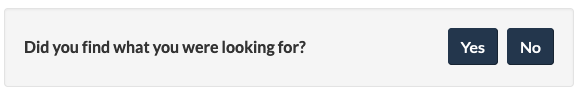
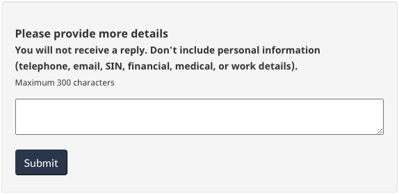
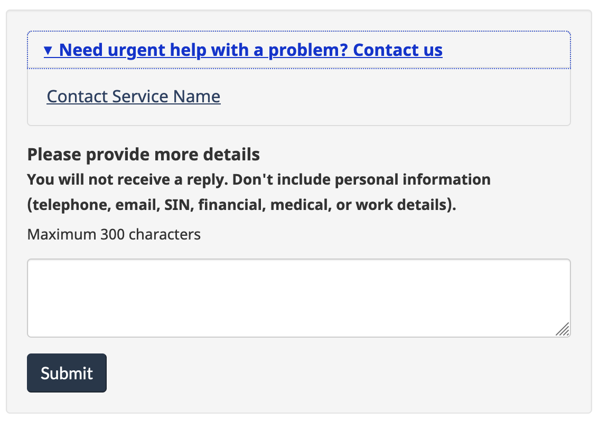
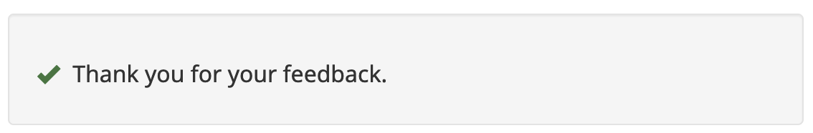

Last updated: October 4, 2023

The feedback tool is an **optional** pattern to collect feedback on the page experience. It appears at the bottom of the page where you will be collecting feedback.

## On this page

*   [When to use](#when-to-use)
*   [What to avoid](#what-to-avoid)
*   [Content and design](#content-and-design)
*   [How to implement](#how)
*   [Research and rationale](#research)
*   [Discussion](#discussion)

## When to use

Consider adding the page feedback tool to:

*   uncover specific page-level issues affecting your GC Task Success Survey task score
*   research issues on pages you plan on working on in the future
*   understand if new or existing pages are meeting user needs
*   identify emerging issues
*   monitor after page improvements have gone live

## What to avoid

Avoid using the page feedback tool on pages where there is no plan to monitor comments or take action. We also don’t recommend using the tool within secure spaces or pages with sensitive subject material.

[Additional behaviours to avoid when analyzing feedback](https://design.canada.ca/feedback/when.html#how-not-to-use-the-tool)

## Content and design

The feedback tool invites visitors to:

<ul>
<li>indicate if they found what they were looking for (yes / no)</li>
<li>offer their feedback describing the problem</li>
</ul>

The tool is placed at the bottom of the page before the date modified.  It is aligned to the left of the page before the “Share this page” widget. The page feedback pattern can be used in place of the  "Report a problem" pattern. It is not mandatory to add the feedback pattern when removing “Report a problem” from your page. 

The page feedback pattern has 3 states:

<ul>
<li>“Did you find what you were looking for?” prompt with “Yes” and “No” buttons</li>
<li>Feedback text entry box (with an option to add a customizable contact link)</li>
<li>Thank you message </li>
</ul>

<a href="https://design.canada.ca/feedback/index.html">This pattern also has detailed documentation for use and analysis of feedback</a>.

<h3>Content specifications</h3>

When you first add the feedback tool to your page, use the default option without the contact link.

Only consider adding a contact link in the page feedback tool if you have tried to make the page content clearer for how to contact the program or service and users are still using the feedback tool to get a response for their situation.

The link can go to an HTML page or an email address.

Keep the link text short. The recommended wording is “Contact [the Service Name]”

<h4>Interactions</h4>

The feedback pattern has 3 states (prompt, feedback entry, thank you message).  For all of these states, the user stays on the same HTML page as they interact with the feedback pattern.

On page load, the feedback pattern displays the prompt “Did you find what you were looking for” followed by buttons for “Yes” and “No”

<strong>If a user selects "No"</strong> the next step asks the user to provide more details about their experience.

It begins with a heading labelled "Please provide more details", followed by the text "You will not receive a reply.
Don't include personal information (telephone, email, SIN, financial, medical, or work details).
Maximum 300 characters". After selecting "Submit", the user is shown a thank you message.

Then there is an open text field to capture the feedback.

If the contact option is used, a contact link for the service is placed inside an expando labeled “Need urgent help with a problem? Contact us” located before the heading and open text field.

The user selects the “Submit” button to send their feedback.
After selecting "Submit", the user is shown a thank you message with a green checkmark to indicate that their feedback has been successfully sent.

If the contact option is used, a contact link for the service is placed inside an expando labeled “Need urgent help with a problem? Contact us”.

<strong>If a user selects "Yes"</strong> they will only be shown a thank you message.

<h3>Design specifications</h3>

The feedback pattern replaces the "Report a problem" pattern when in use.

<h4>Text uses standard Canada.ca styles</h4>
<ul>
<li>“Did you find what you were looking for” is the legend class from fieldset</li>
<li>The feedback instructions text uses body text</li>
<li><a href="https://design.canada.ca/styles/typography.html">Use standard typography styles</a></li>
</ul>

<h4>Buttons</h4>
<ul>
<li>The ‘Yes’ button is to the left of the ‘No’ button </li>
<li><a href="https://design.canada.ca/common-design-patterns/buttons.html#primary">Use standard primary style </a></li>
</ul>

<h4>Thank you checkmark icon</h4>
<ul>
<li>Checkmark glyphicon in “success” green</li>
</ul>

<h3>Visual examples</h3>

<h4>1. Initial view of the feedback tool</h4>

Image description: On page load, the feedback is located at the bottom of the web page above the date modified. A small gray well includes the prompt “Did you find what you were looking for?” followed by buttons for “Yes” and “No”. 

<h4>2a. Default view after selecting "No"</h4>

Image description: After interacting with the “No” button in, a text entry screen will replace the prompt.  There is a heading for “Please provide more details” followed by instructions to not include personal information: “You will not receive a reply. Don’t include personal information (telephone, email, SIN financial, medical, or work details. Maximum 300 characters.”  There is a small text entry box followed by a button for “Submit”.

<h4>2b. Optional view after selecting "No" with contact option</h4>

The expando labeled “Need urgent help with a problem? Contact us” will be closed by default.

Image description: After interacting with the “No” button in, a text entry screen will replace the prompt.  

In the contact option, there is an expando with the header “Need urgent help with a problem? Contact us”.  When the expando is opened, there is a customizable link to contact the service.

After the expando, there is a heading for “Please provide more details” followed by instructions to not include personal information: “You will not receive a reply. Don’t include personal information (telephone, email, SIN financial, medical, or work details. Maximum 300 characters.”  There is a small text entry box followed by a button for “Submit”.

<h4>3. View after selecting "Yes" or after submitting feedback</h4>

Image description: When users select “Yes” from the initial prompt or after submitting their feedback, a thank you message is displayed.  There is a green checkmark icon followed by the heading “Thank you for your feedback”

<h2>How to implement</h2>

Add it to the bottom of a content page after the page content and before the date modified. 

<h3>Feedback tool for AEM pages</h3>

Use these instructions for any page hosted on the Adobe Managed Web Service.

Instructions

<h4>Add the feedback component</h4>

<mark>Need link to this</mark><a href="">How to add the feedback component to your page in AEM</a>. (Internal only on GCPedia)

<h4>Optional but recommended Add a theme hidden value in the feedback code</h4>

This is useful when you want to download feedback for an entire theme of pages at the same time.

In most cases, you should include the Canada.ca theme for your content (full list below). 

This is a unilingual value - enter the same theme value to your English and French pages.

Canada.ca theme values

<ul>
<li>About Gov</li>
<li>Benefits</li>
<li>Business</li>
<li>CanadaTheWorld</li>
<li>Culture</li>
<li>Defense</li>
<li>Environment</li>
<li>Health</li>
<li>Immigration</li>
<li>Indigenous</li>
<li>Jobs</li>
<li>Money</li>
<li>Policing</li>
<li>PublicService</li>
<li>Science</li>
<li>Taxes</li>
<li>Transport</li>
<li>Travel</li>
<li>Veterans</li>
</ul>

If you would like to add a new theme value that is not currently in the Feedback Viewer, contact the Canada Digital Service. We will add the new theme value into the Feedback Viewer.

<h4>Optional Add a “Section” hidden value in the feedback code</h4>

This is useful when you want to download feedback for multiple pages at the same time.

Consider including this value when you are adding the feedback tool to multiple pages on the same topic, such as “passports” or “employment insurance”.

This is a unilingual value - enter the same section value to your English and French pages.

If you would like to add a new section value that is not currently in the Feedback Viewer, contact the Canada Digital Service. We will add the new section value into the Feedback Viewer.

<h4>Optional Contact link</h4>

Only consider adding a contact link if Only consider adding a contact link if you have tried to make the page content clearer for how to contact the program or service and users are still using the feedback tool to get a response for their situation.

                            

<h3>Feedback tool code for non-AEM pages</h3>

Use these instructions for any page that is not hosted on the Adobe Managed Web Service.

Instructions

<h4>Add the feedback component</h4>

Insert the feedback tool code where the “Report a problem on this page” is located in your page's HTML.

<h4>Add the mandatory hidden values</h4>

Update the data attribute for:

<ul>
<li>Department acronym (unilingual value)<mark>check this - should we add the list?</mark></li>
</ul>

<h4>Optional but recommended Add a theme hidden value in the feedback code</h4>

This is useful when you want to download feedback for an entire theme of pages at the same time.

In most cases, you should include the Canada.ca theme for your content (full list below). 

This is a unilingual value - enter the same theme value to your English and French pages.

Canada.ca theme values

<ul>
<li>About Gov</li>
<li>Benefits</li>
<li>Business</li>
<li>CanadaTheWorld</li>
<li>Culture</li>
<li>Defense</li>
<li>Environment</li>
<li>Health</li>
<li>Immigration</li>
<li>Indigenous</li>
<li>Jobs</li>
<li>Money</li>
<li>Policing</li>
<li>PublicService</li>
<li>Science</li>
<li>Taxes</li>
<li>Transport</li>
<li>Travel</li>
<li>Veterans</li>
</ul>

If you would like to add a new theme value that is not currently in the Feedback Viewer, contact the Canada Digital Service. We will add the new theme value into the Feedback Viewer.

<h4>Optional Add a “Section” hidden value in the feedback code</h4>

This is useful when you want to download feedback for multiple pages at the same time.

Consider including this value when you are adding the feedback tool to multiple pages on the same topic, such as “passports” or “employment insurance”.

This is a unilingual value - enter the same section value to your English and French pages.

If you would like to add a new section value that is not currently in the Feedback Viewer, contact the Canada Digital Service. We will add the new section value into the Feedback Viewer.

<h4>Optional Contact link</h4>

Only consider adding a contact link if Only consider adding a contact link if you have tried to make the page content clearer for how to contact the program or service and users are still using the feedback tool to get a response for their situation.

Code

<ul>
<li><a href="https://wet-boew.github.io/GCWeb/sites/feedback/feedback-docs-en.html#variantPFT">Page Feedback Tool (default)</a></li>
<li><a href="https://wet-boew.github.io/GCWeb/sites/feedback/feedback-docs-en.html#variantPFTContact">Page Feedback Tool with contact link</a></li>
</ul>

<h3 id="guidance">Accessing and analyzing feedback</h3>

Feedback can be viewed and downloaded as CSV or Excel files at any time using the Feedback Viewer website.

The Feedback Viewer is a password protected environment available to all page feedback participants. Contact the Canada Digital Service to access to the site.

Email: <a href="mailto:dto.btn@tbs-sct.gc.ca">dto.btn@tbs-sct.gc.ca</a>

<a href="https://design.canada.ca/feedback/index.html">Full guidance for using and analyzing page feedback</a> 

<h2>Research and rationale</h2>

<h3>Research findings</h3>

<a href="https://blog.canada.ca/2020/10/09/collect-feedback.html">Blog post: Collect feedback, find issues</a>

<h3>Policy rationale</h3>

The <cite>Guideline for Service and Digital</cite> requires <a href="https://www.canada.ca/en/government/system/digital-government/guideline-service-digital.html#ToC2_2">client feedback</a> to be an integral part of service or product design. It can take several forms, including using the page feedback tool.

<h2>Discussion</h2>
<ul>

<li><a href="mailto:dto.btn@tbs-sct.gc.ca">Send an email to the Canada Digital Service</a></li>
</ul>
