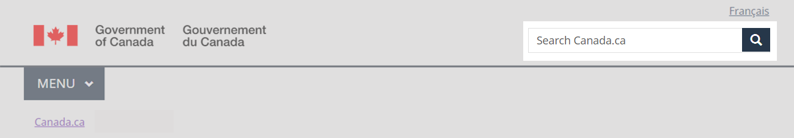

<h1 property="name" id="wb-cont" dir="ltr">Site search box: Canada.ca design system</h1>

  

    <ul class="list-inline small mrgn-bttm-sm" style="line-height:1.65em" id="list-inline-desktop-only">
      <li class="mrgn-rght-lg"> Last updated: YYYY-MM-DD</li>
    </ul>
  

Mandatory

All public-facing Government of Canada content is available in both official languages. A language toggle in the global header provides access to the corresponding page in the other official language.

  <figure class="mrgn-bttm-sm"></figure>

<section>
  <h2>On this page</h2>
  <ul>
    <li><a href="#when">When to use</a></li>
    <li><a href="#avoid">What to avoid</a></li>
    <li><a href="#content">Content and design</a></li>
    <li><a href="#implementation">How to implement</a></li>
    <li><a href="#research">Research and rationale</a></li>
    <li><a href="#changes">Latest changes</a></li>
    <li><a href="#discussion">Discussion</a></li>
  </ul>
</section>
<h2 id="when">When to use</h2>

The language toggle is mandatory on all pages.

New transactional pages for web applications must allow people to toggle between official languages. Legacy web applications that don’t support toggling should be updated or replaced. Until then, you can omit the language toggle if its use results in a loss of data.

<h2 id="avoid">What to avoid</h2>

Don’t put other language options in the language toggle. It is only for English and French. Links to content in other languages should appear in the content area of the page.

Don’t use the language toggle to point to anything other than the corresponding page in the equivalent language.

<h2 id="content">Content and design</h2>

Find content and design specifications and visual examples.

<h3>Content specifications</h3>

Ensure that the language toggle links to the corresponding page in the alternate language.

<h4>Large screens</h4>
<ul>
  <li>On English pages, the link label text is “Français”</li>
  <li>On French pages, the link label text is “English”</li>
</ul>
<h4>Small screens</h4>

For small screens, the language toggle uses a 2-letter abbreviation for each language:

<ul>
  <li>On English pages, the link label text is “FR” in uppercase</li>
  <li>On French pages, the link label text is “EN” in uppercase</li>
</ul>
<h4>Accessibility</h4>
<ul>
  <li>Add the full name of the language in the title attribute for the abbreviated language toggle
    <ul>
      <li>the abbreviation title for EN is “English” 
        the abbreviation title for FR is “Français”</li>
    </ul>
  </li>
</ul>
<h4>Interactions</h4>
<ul>
  <li>When selected, the language toggle brings the user to the alternate language version of the page they were on</li>
</ul>
<h3>Design specifications</h3>
<ul>
  <li>Type: link</li>
  <li>Position: top-right corner</li>
  <li>Font: Lato</li>
  <li>Size: 1.2 em</li>
  <li>Text colour:
    <ul>
      <li>default link: #284162</li>
      <li>selected link (on hover or focus): #0535d2</li>
      <li>visited link: #284162</li>
    </ul>
  </li>
</ul>
<h4>Accessibility</h4>
<ul>
  <li>Label the language toggle code so that it’s spoken in the correct language if read aloud by assistive technologies</li>
  <li>Ensure that the text label for the language toggle won’t be translated by browser translation tools</li>
</ul>
<h3>Visual examples</h3>

  <figure>
    <figcaption><b>Global header with breadcrumb trail  - large screen</b></figcaption>
    
    

      
Text version

      
On large screens, the global header has 4 rows:

      <ol>
        <li>Language toggle in the top-right corner</li>
        <li>Government of Canada signature in the left corner, site search box on the right</li>
        <li>Below a divider line, the theme and topic menu is on the left, the optional Sign in button is on the right</li>
        <li>Breadcrumb on the left</li>
      </ol>
    

  </figure>

  <figure>
    <figcaption><b>Global header – small screen</b></figcaption>
    
    

      
Text version

      
On small screens, the global header on a standard page has 4 rows:

      <ol>
        <li>Government of Canada signature in the top-left corner, language toggle in the top-right corner</li>
        <li>Site search box directly below, it spans the entire row</li>
        <li>Below a divider line, the theme and topic menu is on the left, the optional Sign in button is</li>
      </ol>
    

  </figure>

<h2 id="implementation">How to implement</h2>

Find working examples for implementing the breadcrumbs.

<h3>GCweb (WET) theme implementation reference</h3>

The implementation reference includes how to configure each element of the header.

<ul>
  <li><a href="https://wet-boew.github.io/GCWeb/sites/breadcrumbs/breadcrumbs-en.html">Breadcrumbs - GCWeb (WET) documentation</a></li>
  <li><a href="https://wet-boew.github.io/GCWeb/sites/header/header-docs-en.html">GCWeb (WET) header documentation</a></li>
  <li><a href="https://wet-boew.github.io/GCWeb/docs/implementing-en.html">Quick implementation guide - GCWeb theme</a></li>
</ul>
<h3>Implementations</h3>

Determine what best suits the type of page you're creating. Refer to your implementation's guidance if you want to exclude breadcrumbs.

  

    

      

        

          
<strong>GC-AEM</strong>

          
For the Government of Canada Adobe Experience Manager (AEM):

          <ul>
            <li><a href="https://www.gcpedia.gc.ca/gcwiki/images/9/9a/AEM-6.5-Documentation-Unit-3-7-Changing-the-Default-Breadcrumb.pdf">Changing the default breadcrumb (PDF - GCPedia link - only available on the Government of Canada network)</a></li>
            <li><a href="https://www.gcpedia.gc.ca/wiki/AEM_GC-specific_Documentation_6.5">AEM/Managed Web Service documentation (GCPedia link - only available on the Government of Canada network)</a></li>
          </ul>
        

        

          
<strong>CDTS</strong>

          
For the Centrally Deployed Templates Solution (CDTS):

          <ul>
            <li><a href="https://cdts.service.canada.ca/app/cls/WET/gcweb/v4_0_47/cdts/samples/breadcrumbs-en.html">Breadcrumbs - CDTS documentation </a></li>
            <li><a href="https://cenw-wscoe.github.io/sgdc-cdts/docs/index-en.html">CDTS documentation</a></li>
          </ul>
        

        

          
<strong>Drupal WxT</strong>

          
For Drupal WxT:

          <ul>
            <li><a href="https://drupalwxt.github.io/en/">Drupal WxT documentation</a></li>
          </ul>
        

      

    

  

  <h2 id="research">Research and rationale</h2>
  
Consult research findings and policy rationale.

  <h3>Research findings</h3>
  
<a href="https://blog.canada.ca/2020/08/10/CanadaDotCa-trusted-source.html">Canada.ca is a trusted source</a> 
    Explains the decision to use “Canada.ca” as the label for the first link in the breadcrumb.

  
<a href="https://blog.canada.ca/research-summaries/wayfinding-on-canada-ca.html">Wayfinding on Canada.ca research summary</a> 
    Research shows that people navigating on the site use breadcrumb links nearly twice as often as they use the Theme and topic menu.

  
Further design and research work to optimize the breadcrumb for mobile is planned.

  <h3>Policy rationale</h3>
  
As part of the global header, the breadcrumb is a mandatory element under the Content and Information Architecture Specification.

  <ul>
    <li><a href="https://www.canada.ca/en/treasury-board-secretariat/services/government-communications/canada-content-information-architecture-specification/mandatory-elements.html">Mandatory elements of the design system</a></li>
  </ul>
  <h2 id="changes">Latest changes</h2>
  <dl class="dl-horizontal">
    <dt>
      <time datetime="2023-MM-DD" class="link-muted">2023-MM-DD</time>
    </dt>
    <dd>Updated the guidance to include content and design specifications, visual examples and implementation guidance</dd>
  </dl>
  <h2 id="discussion">Discussion</h2>
  <ul>
    <li><a href="https://github.com/canada-ca/design-system/issues">Discuss the pattern in GitHub Issues</a></li>
    <li><a href="http://design-GC-conception.slack.com">Join the conversation on Slack</a></li>
  </ul>

