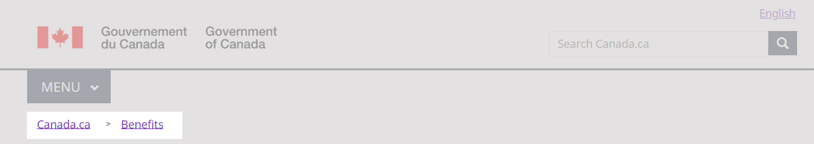
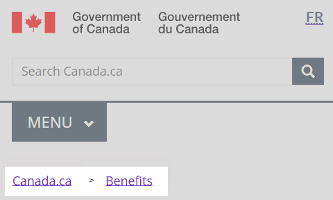

<h1 property="name" id="wb-cont" dir="ltr">Theme and topic menu: Canada.ca design system</h1>

  

    <ul class="list-inline small mrgn-bttm-sm" id="list-inline-desktop-only">
      <li class="mrgn-rght-lg"> Last updated: YYYY-MM-DD</li>
    </ul>
  

Mandatory on standard pages

The theme and topic menu provides access to the top tasks from all Government of Canada websites grouped under the main themes of Canada.ca.

  <figure class="mrgn-bttm-sm"></figure>

<section>
  <h2>On this page</h2>
  <ul>
    <li><a href="#when">When to use</a></li>
    <li><a href="#avoid">What to avoid</a></li>
    <li><a href="#content">Content and design</a></li>
    <li><a href="#implementation">How to implement</a></li>
    <li><a href="#research">Research and rationale</a></li>
    <li><a href="#changes">Latest changes</a></li>
  </ul>
</section>
<h2 id="when">When to use</h2>

<strong>2023 design update</strong>: We’ve recently updated this pattern as part of a new navigation strategy coming out of the Wayfinding research project. The theme and topic menu is in transition. To find out more about this project, visit the <a href="#research">Research and rationale</a> section on this page. 

<h3>Current situation</h3>

Apply the theme and topic menu as follows:

<ul>
  <li><strong>campaign pages</strong> optional</li>
  <li><strong>transactional pages</strong> optional but not recommended</li>
  <li><strong>theme and topic pages</strong> mandatory</li>
</ul>

On <strong>standard destination pages</strong> and <strong>institutional landing pages</strong>, the theme and topic menu is mandatory until ALL the following conditions are met:

<ul>
  <li>the page has the 2023 <a href="site-footer.html">global footer</a></li>
  <li>the menu regularly receives less than 1% of clicks within a group of related pages
    <ul>
      <li>if you’re adopting the design for the first time, you don’t need to add the menu</li>
    </ul>
  </li>
  <li>you’ve added a <a href="contextual-signin.html">contextual Sign in button</a> where it’s relevant to the content</li>
</ul>

A group of pages might be an entire theme, all the pages related to a specific program or service, or all the pages related to a single organization.

<h3>Future state</h3>

Eventually we will retire the theme and topic menu pattern. The theme page links are in the main band of the global footer.

<h2 id="avoid">What to avoid</h2>

Don’t repurpose the Theme and topic menu for other navigation. The menu is a global navigation tool. It’s confusing for users if it behaves differently depending on where they are in the site.

Don’t remove it from standard destination pages before you meet the conditions above.

Don’t change the style or colour scheme.

Don’t put additional links or text in the flyout.

<h2 id="content">Content and design</h2>

The theme and topic menu consists of 3 integrated elements - the menu button which opens and closes the menu, the theme list that allows for choosing between themes, and the flyout that presents topics and most requested links for each theme.

<h3>Content specifications</h3>
<ol>
  <li>Menu button:
    <ul>
      <li>label is “MENU” with a downwards caret</li>
    </ul>
  </li>
  <li class="mrgn-tp-lg">Theme list, which includes the 15 main Canada.ca themes in the following order:
    <ul>
      <li>Jobs and the workplace</li>
      <li>Immigration and citizenship</li>
      <li>Travel and tourism</li>
      <li>Business and industry</li>
      <li>Benefits</li>
      <li>Health</li>
      <li>Taxes</li>
      <li>Environment and natural resources</li>
      <li>National security and defence</li>
      <li>Culture, history and sport</li>
      <li>Policing, justice and emergencies</li>
      <li>Transport and infrastructure</li>
      <li>Canada and the world</li>
      <li>Money and finances</li>
      <li>Science and innovation</li>
    </ul>
  </li>
  <li class="mrgn-tp-lg">Flyout:
    
Hovering or clicking on one of the 15 themes reveals a flyout containing:

    <ul>
      <li>a link to the landing page for the theme itself</li>
      <li>first-level topics within that theme</li>
      <li>Most requested links based on the highest demand items for that theme</li>
    </ul>
  </li>
</ol>

Topics and Most requested links should appear in the same order on both the menu and the theme page.

<h4>Interactions</h4>
<h5>Large screens</h5>
<ul>
  <li>Clicking on the menu button expands the theme list element with the Jobs flyout open</li>
  <li>Once opened, hovering or clicking on one of the 15 themes reveals a flyout for that theme</li>
  <li>Clicking on the menu a second time closes it</li>
</ul>
<h5>Small screens</h5>
<ul>
  <li>Tapping the menu button expands the theme list as a series of submenu options</li>
  <li>Tapping any theme option expands the list of topics for that theme and reveals another submenu option for the Most requested</li>
  <li>Tapping the Most requested option expands the list of most requested links for that theme</li>
  <li>Tapping any expanded item again will close it</li>
</ul>
<h3>Design specifications</h3>

Design specifications for the breadcrumbs are:

<ul>
  <li>Type: link</li>
  <li>Position: top left</li>
  <li>Font: Noto sans</li>
  <li>Size: 16px</li>
  <li>Text colour:
    <ul>
      <li>default link: #284162</li>
      <li>selected link (on hover or focus): #0535d2</li>
      <li>visited link: #7834bc</li>
    </ul>
  </li>
  <li>Spacing: padding: 0 5px</li>
  <li>Icon: glyphicon-chevron-right</li>
</ul>
<h4>Accessibility</h4>

Code breadcrumbs as an ordered list

<h4>Examples</h4>

Here are some examples of breadcrumbs for different locations on Canada.ca

<h5>Theme pages, institutional and organizational pages</h5>

Canada.ca

<h5>First-level topic pages</h5>

Canada.ca   &#8250;   [Parent theme]

<h5>Second-level topic pages</h5>

Canada.ca    &#8250;   [Parent theme]    &#8250;   [Parent topic]

<h5>Destination content pages</h5>

Canada.ca    &#8250;   [Parent theme]    &#8250;   [Parent topic]   &#8250;  [Parent sub-topic]   &#8250;   [etc.]

<h5>Corporate, program or policy content pages</h5>

Canada.ca   &#8250;   [Institutional profile page]

<h5>Partnering and collaborative arrangement profile pages</h5>

Canada.ca

<h5>Basic search pages</h5>

Canada.ca

<h5>Advanced search pages</h5>

Canada.ca   &#8250;   [Basic search]

<h5>Campaigns and promotions</h5>

Promotion campaigns don't need a breadcrumb trail. If you add one, it can lead back to the topic tree, the Institutional/Organizational profile, or to the Home page of Canada.ca.

<h5>News</h5>

Canada.ca   &#8250;   [Institutional profile page]

<h3>Visual examples</h3>

  <figure>
    <figcaption><b>Global header with breadcrumb trail  - large screen</b></figcaption>
    
    

      
Image description: global header with breadcrumb trail  - large screen

      
The breadcrumbs appear under the menu button in a horizontal line.

    

  </figure>

  <figure>
    <figcaption><b>Global header – small screen</b></figcaption>
    
    

      
Image description: global header with breadcrumb trail  - small screen

      
The breadcrumbs appear under the menu button.

    

  </figure>

<h2 id="implementation">How to implement</h2>

Find working examples for implementing the breadcrumbs.

<h3>GCweb (WET) theme implementation reference</h3>

The implementation reference includes how to configure each element of the header.

<ul>
  <li><a href="https://wet-boew.github.io/GCWeb/sites/breadcrumbs/breadcrumbs-en.html">Breadcrumbs - GCWeb (WET) documentation</a></li>
  <li><a href="https://wet-boew.github.io/GCWeb/sites/header/header-docs-en.html">GCWeb (WET) header documentation</a></li>
  <li><a href="https://wet-boew.github.io/GCWeb/docs/implementing-en.html">Quick implementation guide - GCWeb theme</a></li>
</ul>
<h3>Implementations</h3>

Determine what best suits the type of page you're creating. Refer to your implementation's guidance if you want to exclude breadcrumbs.

  

    

      

        

          
<strong>GC-AEM</strong>

          
For the Government of Canada Adobe Experience Manager (AEM):

          <ul>
            <li><a href="https://www.gcpedia.gc.ca/gcwiki/images/9/9a/AEM-6.5-Documentation-Unit-3-7-Changing-the-Default-Breadcrumb.pdf">Changing the default breadcrumb (PDF - GCPedia link - only available on the Government of Canada network)</a></li>
            <li><a href="https://www.gcpedia.gc.ca/wiki/AEM_GC-specific_Documentation_6.5">AEM/Managed Web Service documentation (GCPedia link - only available on the Government of Canada network)</a></li>
          </ul>
        

        

          
<strong>CDTS</strong>

          
For the Centrally Deployed Templates Solution (CDTS):

          <ul>
            <li><a href="https://cdts.service.canada.ca/app/cls/WET/gcweb/v4_0_47/cdts/samples/breadcrumbs-en.html">Breadcrumbs - CDTS documentation </a></li>
            <li><a href="https://cenw-wscoe.github.io/sgdc-cdts/docs/index-en.html">CDTS documentation</a></li>
          </ul>
        

        

          
<strong>Drupal WxT</strong>

          
For Drupal WxT:

          <ul>
            <li><a href="https://drupalwxt.github.io/en/">Drupal WxT documentation</a></li>
          </ul>
        

      

    

  

<h2 id="research">Research and rationale</h2>

Consult research findings and policy rationale.

<h3>Research findings</h3>

<a href="https://blog.canada.ca/2020/08/10/CanadaDotCa-trusted-source.html">Canada.ca is a trusted source</a> 
  Explains the decision to use “Canada.ca” as the label for the first link in the breadcrumb.

<a href="https://blog.canada.ca/research-summaries/wayfinding-on-canada-ca.html">Wayfinding on Canada.ca research summary</a> 
  Research shows that people navigating on the site use breadcrumb links nearly twice as often as they use the Theme and topic menu.

Further design and research work to optimize the breadcrumb for mobile is planned.

<h3>Policy rationale</h3>

As part of the global header, the breadcrumb is a mandatory element under the Content and Information Architecture Specification.

<ul>
  <li><a href="https://www.canada.ca/en/treasury-board-secretariat/services/government-communications/canada-content-information-architecture-specification/mandatory-elements.html">Mandatory elements of the design system</a></li>
</ul>
<h2 id="changes">Latest changes</h2>
<dl class="dl-horizontal">
  <dt>
    <time datetime="2023-MM-DD" class="link-muted">2023-MM-DD</time>
  </dt>
  <dd>Updated the guidance to include content and design specifications, visual examples and implementation guidance</dd>
</dl>
