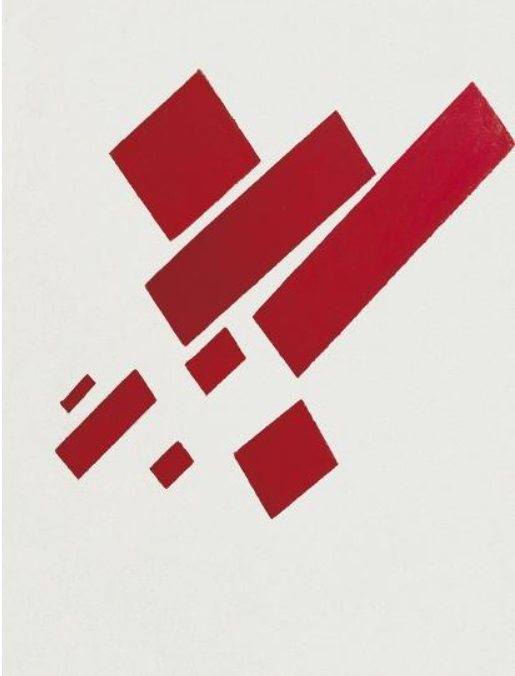

<h1 property="name" id="wb-cont" dir="ltr">Institutional landing page documentation: Canada.ca design system</h1>

  

    
Let’s update the documentation for the new institutional landing page by bringing it into the new content model.

    <h2 class="mrgn-tp-lg">Mockups</h2>
    
Format for the Content and design section.

    <ul class="list-unstyled">
      <li>
        

          
List vs. table

          <ul class="mrgn-tp-lg">
            <li>List
              <ul>
                <li><a href="03-content-and-design.html">List</a></li>
              </ul>
            </li>
            <li>Table
              <ul>
                <li><a href="07-content-and-design.html">Table</a></li>
              </ul>
            </li>
          </ul>
        

      </li>
      <li>
        

          
Workshop

          <ul class="mrgn-tp-lg">
            <li>Definition list
              <ul>
                <li><a href="01-content-and-design.html">Expanded</a></li>
                <li><a href="04-content-and-design.html">Expanded with labels</a></li>
                <li><a href="02-content-and-design.html">Closed</a></li>
                <li><a href="06-content-and-design.html">Closed with labels</a></li>
              </ul>
            </li>
            <li>Basic list
              <ul>
                <li><a href="03-content-and-design.html">List</a></li>
                <li><a href="05-content-and-design.html">List with labels</a></li>
              </ul>
            </li>
            <li>Table
              <ul>
                <li><a href="09-content-and-design.html">No Borders</a></li>
                <li><a href="07-content-and-design.html">Zebra striping</a></li>
                <li><a href="08-content-and-design.html">Borders</a></li>
                <li><a href="10-content-and-design.html">With color (just for fun)</a></li>
              </ul>
            </li>
          </ul>
        

      </li>
    </ul>
  

  

    

      <figure>
        <figcaption class="caption small mrgn-tp-md"><cite>Eight Red Rectangles</cite> (1915) by Kazimir Malevich.  The abstract piece shows eight red rectangles of various sizes placed at different angles on a white background.</figcaption>
      </figure>
    

  

