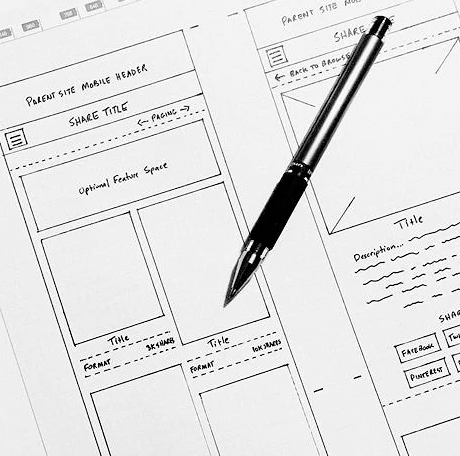

<h1 property="name" id="wb-cont" dir="ltr">Institutional landing page documentation: Canada.ca design system</h1>

  

    
Alt text investigation

    <h2 class="h3 mrgn-tp-lg">Mockups</h2>
    <ul class="fa-ul">
      <li><a href="alt-text-en-01.html">Alt text + long description</a></li>
    </ul>
  

  

    

  

