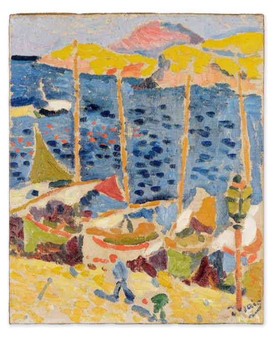

<h1 property="name" id="wb-cont" dir="ltr">Institutional landing page documentation: Canada.ca design system</h1>

  

    
Let’s update the documentation for the new institutional landing page by bringing it into the new content model.

    <ul>
      <li><a href="https://docs.google.com/document/d/1L1TgppZW6Nl5vR8mGZYGuD2MiBUomzvW4qMBaMnYIBk/edit#heading=h.cgqy08psd8f0">Content model</a></li>
      <li><a href="https://test.canada.ca/experimental/design-system/coded-layout/institutional_landing_page_guidance-code-only.html">ILP prototype</a></li>
    </ul>
    <h2 class="h3 mrgn-tp-lg">Mockups</h2>
    <h3 class="h4">ILP landing page</h3>
    <ul class="fa-ul">
      <li>ILP landing page (English mockup)</li>
      <li>ILP landing page (French mockup)</li>
    </ul>
    

      

        <ul class="fa-ul">
          <li><a href="https://scma-dto.monday.com/boards/2632043469/pulses/4410681640">Monday</a></li>
          <li><a href="https://design.canada.ca/mandatory-templates/institutional-profile-pages.html">ILP landing page (current page)</a></li>
          <li><a href="https://docs.google.com/document/d/11v-AeuqxdtnkXNgycpp814fc3BfyQHxI2TpSCNgYtlY">ILP landing page (French doc)</a></li>
          <li>ILP landing page (French doc)</li>
        </ul>
      

    

    <h3 class="h4">Intro block pattern</h3>
    <ul class="fa-ul">
      <li>Intro block pattern (English mockup)</li>
      <li>Intro block pattern (French mockup)</li>
    </ul>
    

      

        <ul class="fa-ul">
          <li><a href="">Monday</a></li>
          <li><a href="https://design.canada.ca/mandatory-templates/institutional-profile-pages.html">ILP landing page (current page)</a></li>
          <li>Intro block pattern (French doc)</li>
          <li>Intro block pattern (French doc)</li>
        </ul>
      

    

    <h3 class="h4">Featured link pattern</h3>
    <ul class="fa-ul">
      <li>Featured link pattern (English mockup)</li>
      <li>Featured link pattern (French mockup)</li>
    </ul>
    

      

        <ul class="fa-ul">
          <li><a href="">Monday</a></li>
          <li><a href="https://design.canada.ca/mandatory-templates/institutional-profile-pages.html">ILP landing page (current page)</a></li>
          <li>Featured link pattern (French doc)</li>
          <li>Featured link pattern (French doc)</li>
        </ul>
      

    

    <h3 class="h4">Most requested pattern (Update)</h3>
    <ul class="fa-ul">
      <li>Most requested (English mockup)</li>
      <li>Most requested (French mockup)</li>
    </ul>
    

      

        <ul class="fa-ul">
          <li><a href="">Monday</a></li>
          <li><a href="https://design.canada.ca/mandatory-templates/institutional-profile-pages.html">ILP landing page (current page)</a></li>
          <li>Most requested (French doc)</li>
          <li>Most requested (French doc)</li>
        </ul>
      

    

    <h3 class="h4">Services and information pattern  (Update)</h3>
    <ul class="fa-ul">
      <li>Services and information (English mockup)</li>
      <li>Services and information (French mockup)</li>
    </ul>
    

      

        <ul class="fa-ul">
          <li><a href="">Monday</a></li>
          <li><a href="https://design.canada.ca/mandatory-templates/institutional-profile-pages.html">ILP landing page (current page)</a></li>
          <li>Services and information (French doc)</li>
          <li>Services and information (French doc)</li>
        </ul>
      

    

    <h3 class="h4">Contact us band pattern (add to Contact information pattern)</h3>
    <ul class="fa-ul">
      <li>Contact us (English mockup)</li>
      <li>Contact us (French mockup)</li>
    </ul>
    

      

        <ul class="fa-ul">
          <li><a href="">Monday</a></li>
          <li><a href="https://design.canada.ca/mandatory-templates/institutional-profile-pages.html">ILP landing page (current page)</a></li>
          <li>Contact us (French doc)</li>
          <li>Contact us (French doc)</li>
        </ul>
      

    

    <h3 class="h4">About the institution pattern</h3>
    <ul class="fa-ul">
      <li>About (English mockup)</li>
      <li>About (French mockup)</li>
    </ul>
    

      

        <ul class="fa-ul">
          <li><a href="">Monday</a></li>
          <li><a href="https://design.canada.ca/mandatory-templates/institutional-profile-pages.html">ILP landing page (current page)</a></li>
          <li>About (French doc)</li>
          <li>About (French doc)</li>
        </ul>
      

    

    <h3 class="h4">Social media pattern (Update)</h3>
    <ul class="fa-ul">
      <li>Social media (English mockup)</li>
      <li>Social media (French mockup)</li>
    </ul>
    

      

        <ul class="fa-ul">
          <li><a href="">Monday</a></li>
          <li><a href="https://design.canada.ca/mandatory-templates/institutional-profile-pages.html">ILP landing page (current page)</a></li>
          <li>Social media (French doc)</li>
          <li>Social media (French doc)</li>
        </ul>
      

    

    <h3 class="h4">Ministers block pattern</h3>
    <ul class="fa-ul">
      <li>Ministers block (English mockup)</li>
      <li>Ministers block (French mockup)</li>
    </ul>
    

      

        <ul class="fa-ul">
          <li><a href="">Monday</a></li>
          <li><a href="https://design.canada.ca/mandatory-templates/institutional-profile-pages.html">ILP landing page (current page)</a></li>
          <li>Ministers block (French doc)</li>
          <li>Ministers block (French doc)</li>
        </ul>
      

    

    <h3 class="h4">Latest news pattern (Update)</h3>
    <ul class="fa-ul">
      <li>Latest news (English mockup)</li>
      <li>Latest news (French mockup)</li>
    </ul>
    

      

        <ul class="fa-ul">
          <li><a href="">Monday</a></li>
          <li><a href="https://design.canada.ca/mandatory-templates/institutional-profile-pages.html">ILP landing page (current page)</a></li>
          <li>ILP landing page (French doc)</li>
          <li>ILP landing page (French doc)</li>
        </ul>
      

    

  

  

    

  

