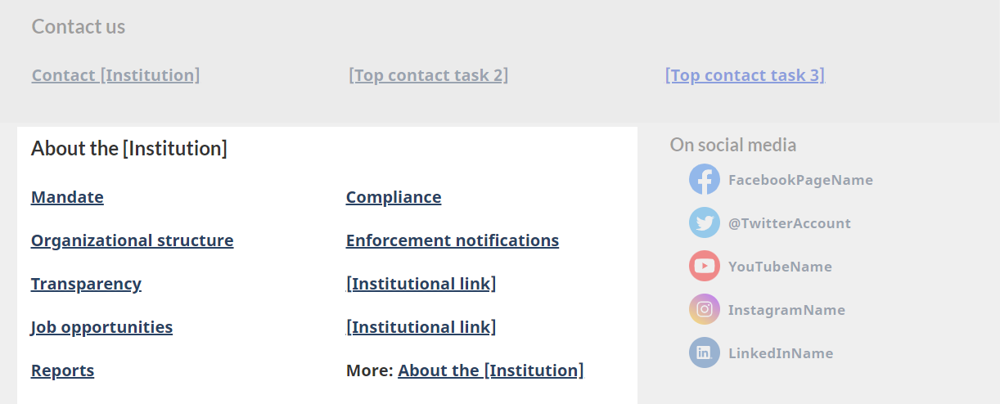

<h1 property="name" id="wb-cont" dir="ltr">About [institution name]: Canada.ca design</h1>

 Last updated: 2023-MM-DD

Mandatory on an institutional landing page

The About [institution name] pattern is a section on an institutional landing page that provides links to corporate, program and policy information.

Mandatory links:

<ul>
  <li>Mandate</li>
  <li>Transparency</li>
</ul>

Optional links:

<ul>
  <li>Programs</li>
  <li>Consultations</li>
  <li>Organizational structure</li>
  <li>Reports</li>
  <li>Job opportunities</li>
  <li>any link to content that falls under Corporate information or Program and policy development</li>
</ul>

  <figure class="mrgn-bttm-lg">  </figure>

  <figure class="mrgn-bttm-lg">
    <figcaption><b>About [institution name] – large screen</b></figcaption>
    
    

      
Image description: About [institution name] – large screen

      
About [institution name] links appear in a section with the heading “About [institution name]”.  Links are organized in a bulleted list:

      <ul>
        <li>Mandate</li>
        <li>Organizational structure</li>
        <li>Transparency</li>
        <li>Job opportunities</li>
        <li>Reports</li>
        <li>Compliance</li>
        <li>Enforcements notifications</li>
        <li>[institutional link]</li>
        <li>[institutional link]</li>
        <li>More: About the institution</li>
      </ul>
    

  </figure>

