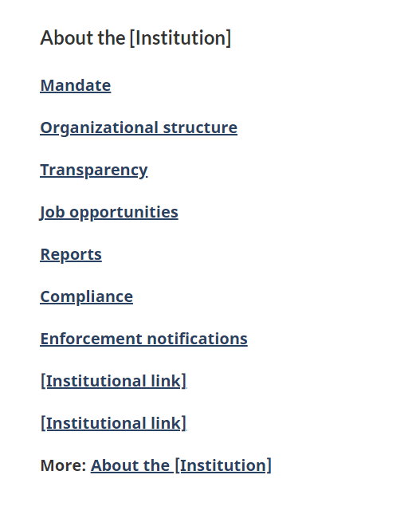

<h1 property="name" id="wb-cont" dir="ltr">About [institution name]: Canada.ca design</h1>

 Last updated: 2023-MM-DD

Mandatory on an institutional landing page

The About [institution name] pattern is a section on an institutional landing page that provides links to corporate, program and policy information.

Mandatory links:

<ul>
  <li>Mandate</li>
  <li>Transparency</li>
</ul>

Optional links:

<ul>
  <li>Programs</li>
  <li>Consultations</li>
  <li>Organizational structure</li>
  <li>Reports</li>
  <li>Job opportunities</li>
  <li>any link to content that falls under Corporate information or Program and policy development</li>
</ul>

  <figure> </figure>

<h2>On this page</h2>
<ul>
  <li><a href="#when">When to use</a></li>
  <!-- <li><a href="#what">What to avoid</a></li>  -->
  <li><a href="#content">Content and design</a></li>
  <li><a href="#how">How to implement</a></li>
  <li><a href="#research">Research and rationale</a></li>
  <li><a href="#changes">Latest changes</a></li>
</ul>
<h2 id="when">When to use</h2>

The About the [institution] section is a mandatory pattern on an Institutional landing page.  It must include Mandate and Transparency links.

<h2 id="content">Content and design</h2>

Find content and design specifications and visual examples.

<h3>Content specifications</h3>
<ul>
  <li>The heading is “About” followed by the name of the institution</li>
  <li>The heading appears above the links on all screen sizes</li>
  <li>Links can include <strong>corporate information</strong> and <strong>business lines</strong>, such as
    <ul>
      <li>institutional mandate and organizational structure</li>
      <li>performance reporting and transparency</li>
      <li>job opportunities</li>
    </ul>
  </li>
  <li>Links can include <strong>program and policy development information</strong>, such as
    <ul>
      <li>information about programs and policies, and activities related to their development</li>
      <li>background information about what is presented on a topic page</li>
      <li>program descriptions, policies, research papers, consultations, statistics, legislation, etc.</li>
    </ul>
  </li>
  <li>Organize the links in a bulleted list</li>
  <li>Make bullets visible so links are easy to scan</li>
  <li>Recommended maximum of 10 links</li>
  <li>Use task-oriented, plain language link labels (avoid program names or titles that may be unfamiliar to people)</li>
  <li>The list of links appears in:
    <ul>
      <li>2 columns on large screens</li>
      <li>1 column on small screens</li>
    </ul>
  </li>
</ul>
<h3>Design specifications</h3>
<ul>
  <li>Background color: #f5f5f5</li>
  <li>Text size: Noto sans: 19px ?</li>
  <li>Heading:  H2, Lato: 1.2em</li>
  <li>Font-weight: Bold?</li>
  <li>Line-height of li: 2em</li>
  <li>Layout: 2 columns of bullets in large and medium viewport, single column in small viewports</li>
</ul>
<h2 id="how">How to implement</h2>
<h3>Visual examples</h3>

  <figure class="mrgn-bttm-md">
    <figcaption><b>About [institution name] – large screen</b></figcaption>
    
    

      
Image description: About [institution name] – large screen

      
About [institution name] links appear in a section with the heading “About [institution name]”.  Links are organized in a bulleted list:

      <ul>
        <li>Mandate</li>
        <li>Organizational structure</li>
        <li>Transparency</li>
        <li>Job opportunities</li>
        <li>Reports</li>
        <li>Compliance</li>
        <li>Enforcements notifications</li>
        <li>[institutional link]</li>
        <li>[institutional link]</li>
        <li>More: About the institution</li>
      </ul>
    

  </figure>

  <figure class="mrgn-bttm-md">
    <figcaption><b>About [institution name] – small screen</b></figcaption>
    
    

      
Image description: About [institution name] – small screen

      
About [institution name] links appear in a section with the heading “About [institution name]”.  Links are organized in a bulleted list:

      <ul>
        <li>Mandate</li>
        <li>Organizational structure</li>
        <li>Transparency</li>
        <li>Job opportunities</li>
        <li>Reports</li>
        <li>Compliance</li>
        <li>Enforcements notifications</li>
        <li>[institutional link]</li>
        <li>[institutional link]</li>
        <li>More: About the institution</li>
      </ul>
    

  </figure>

<h3>GCweb (WET) theme implementation reference</h3>

The implementation reference includes how to configure each element of the header.

<ul>
  <li><a href="https://wet-boew.github.io/GCWeb/docs/implementing-en.html">Quick implementation guide - GCWeb theme</a></li>
</ul>
<h3>Implementations</h3>

Refer to your implementation's guidance to code links.

  

    

      

        

          
<strong>GC-AEM</strong>

          
For the Government of Canada Adobe Experience Manager (AEM):

          <ul>
            <li><a href="https://www.gcpedia.gc.ca/wiki/AEM_GC-specific_Documentation_6.5">AEM/Managed Web Service documentation (GCPedia link - only available on the Government of Canada network)</a></li>
          </ul>
        

        

          
<strong>CDTS</strong>

          
For the Centrally Deployed Templates Solution (CDTS):

          <ul>
            <li><a href="https://cenw-wscoe.github.io/sgdc-cdts/docs/index-en.html">CDTS documentation</a></li>
          </ul>
        

        

          
<strong>Drupal WxT</strong>

          
For Drupal WxT:

          <ul>
            <li><a href="https://drupalwxt.github.io/en/">Drupal WxT documentation</a></li>
          </ul>
        

      

    

  

<h2 id="research">Research and rationale</h2>

Consult research findings and policy rationale.

<!--<h3>Research findings</h3>-->
<h3>Policy rationale</h3>

The About [institution name] section is a mandatory section on Institution landing pages under the Content and Information Architecture Specification.

The About [institution name] links include:

<ul>
  <li><a href="https://www.canada.ca/en/treasury-board-secretariat/services/government-communications/canada-content-information-architecture-specification/organizing-content.html#corporate">Corporate information</a></li>
  <li><a href="https://www.canada.ca/en/treasury-board-secretariat/services/government-communications/canada-content-information-architecture-specification/organizing-content.html#program">Program and policy development</a></li>
</ul>
<h2 id="changes">Latest changes</h2>
<dl class="dl-horizontal">
  <dt>
    <time datetime="2023-MM-DD" class="link-muted">2023-MM-DD</time>
  </dt>
  <dd>Added About [institution name] guidance to support updates to the Institutional landing page</dd>
</dl>
