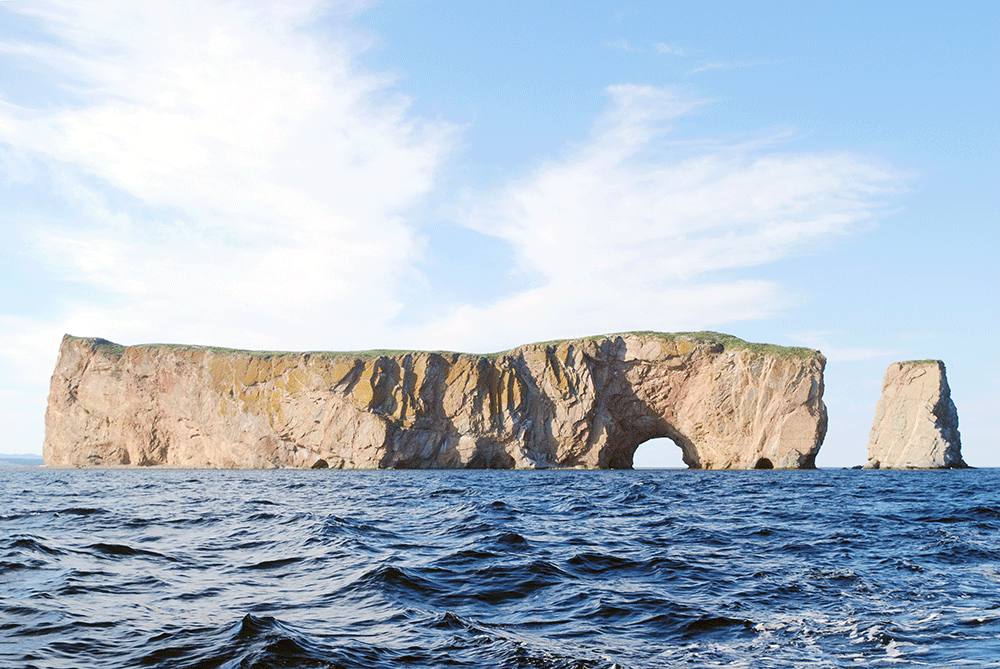

<h1 property="name" id="wb-cont" dir="ltr">Alt text strategies: Canada.ca design system</h1>
  

    <figure>
      <figcaption><b>En-tête général avec fil d’Ariane – grand écran</b></figcaption>
      
      

        
Description de l’image&nbsp;: En-tête général avec fil d’Ariane – grand écran

        
Le fil d’Ariane apparaît sous le bouton de menu dans une ligne horizontale.

      

    </figure>
  

