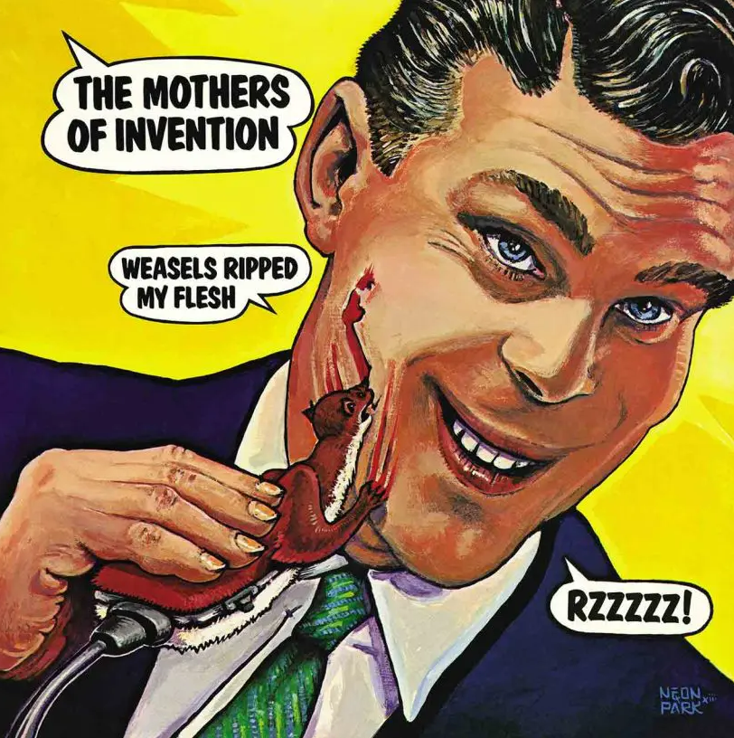

<h1 property="name" id="wb-cont" dir="ltr">Current Alt text: Alt text strategies</h1>

  

    

      <figure>
        <figcaption><b><em>Weasels Ripped My Flesh</em></b></figcaption>
        
        
<em>Weasels Ripped My Flesh</em> (1970) by Frank Zappa.  Illustration by Neon Park.

        

          
Image description: <em>Weasels Ripped My Flesh</em>

          
Album cover depicts an illustration of a vacantly smiling man wearing a suite shaving his face with an electric weasel.  The weasel is ripping his flesh with its claws and teeth.  The illustration is in the style of 1950s Saturday Evening Post cover art.

          
Three word balloons state (in the following order from the top):

          <ul>
            <li>Top left: THE MOTHERS OF INVENTION</li>
            <li>Top left: WEASLE RIPPED MY FLESH</li>
            <li>Bottom right: RZZZZZ!</li>
          </ul>
          
The illustration is signed “NEON PARK” on the bottom left.

        

      </figure>
    

    <h2 class="h3">HTML</h2>
    
    <pre><code>
      &#x3C;figure&#x3E;
        &#x3C;figcaption&#x3E;&#x3C;b&#x3E;&#x3C;em&#x3E;Weasels Ripped My Flesh&#x3C;/em&#x3E;&#x3C;/b&#x3E;&#x3C;/figcaption&#x3E;
        &#x3C;img src=&#x22;./images/wrmf.png&#x22; class=&#x22;img-responsive&#x22; alt=&#x22; &#x22; /&#x3E;
        &#x3C;p class=&#x22;mrgn-tp-md small&#x22;&#x3E;&#x3C;em&#x3E;Weasels Ripped My Flesh&#x3C;/em&#x3E; (1970) by Frank Zappa.  Illustration by Neon Park.&#x3C;/p&#x3E;
        &#x3C;details class=&#x22;mrgn-tp-md&#x22;&#x3E;
          &#x3C;summary class=&#x22;wb-toggle small&#x22; data-toggle=&#x22;{&#x26;quot;print&#x26;quot;:&#x26;quot;on&#x26;quot;}&#x22;&#x3E;Image description: &#x3C;em&#x3E;Weasels Ripped My Flesh&#x3C;/em&#x3E;&#x3C;/summary&#x3E;
          &#x3C;p class=&#x22;mrgn-tp-lg&#x22;&#x3E;Album cover depicts an illustration of a vacantly smiling man wearing a suite shaving his face with an electric weasel.  The weasel is ripping his flesh with its claws and teeth.  The illustration is in the style of 1950s Saturday Evening Post cover art.&#x3C;/p&#x3E;
          &#x3C;p&#x3E;Three word balloons state (in the following order from the top):&#x3C;/p&#x3E;
          &#x3C;ul&#x3E;
            &#x3C;li&#x3E;Top left: THE MOTHERS OF INVENTION&#x3C;/li&#x3E;
            &#x3C;li&#x3E;Top left: WEASLE RIPPED MY FLESH&#x3C;/li&#x3E;
            &#x3C;li&#x3E;Bottom right: RZZZZZ!&#x3C;/li&#x3E;
          &#x3C;/ul&#x3E;&#x3C;p&#x3E;The illustration is signed &#x201C;NEON PARK&#x201D; on the bottom left.&#x3C;/p&#x3E;
        &#x3C;/details&#x3E;
      &#x3C;/figure&#x3E;
	
</code></pre>
  

