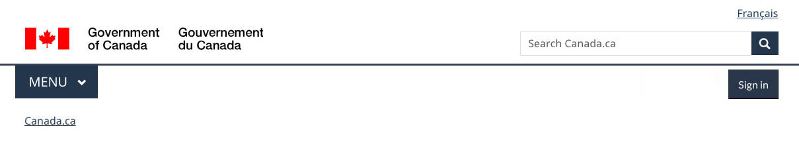

<h1 property="name" id="wb-cont" dir="ltr">Alt text (Global header – large screen): Canada.ca design system</h1>

  

    

      <figure>
        <figcaption><b>Global header – large screen</b></figcaption>
        
        

          
Image description: global header – large screen

          
On large screens, the global header on a standard page has 4 rows:

          <ol>
            <li>Language toggle in the top-right corner</li>
            <li>Government of Canada signature in the left corner, site search box on the right</li>
            <li>Below a divider line, the theme and topic menu is on the left, the optional Sign in button is on the right</li>
            <li>Breadcrumb on the left</li>
          </ol>
        

      </figure>
    

    

      <header class="panel-heading">
        <h2 class="panel-title">Image description information</h2>
      </header>
      

        
[alt text]: none

        
[Caption]: Global header – large screen

        
[Long description title]: Image description: global header – large screen

        
[Long description]:

        
On large screens, the global header on a standard page has 4 rows:

        <ol>
          <li>Language toggle in the top-right corner</li>
          <li>Government of Canada signature in the left corner, site search box on the right</li>
          <li>Below a divider line, the theme and topic menu is on the left, the optional Sign in button is on the right</li>
          <li>Breadcrumb on the left</li>
        </ol>
      

    

  

