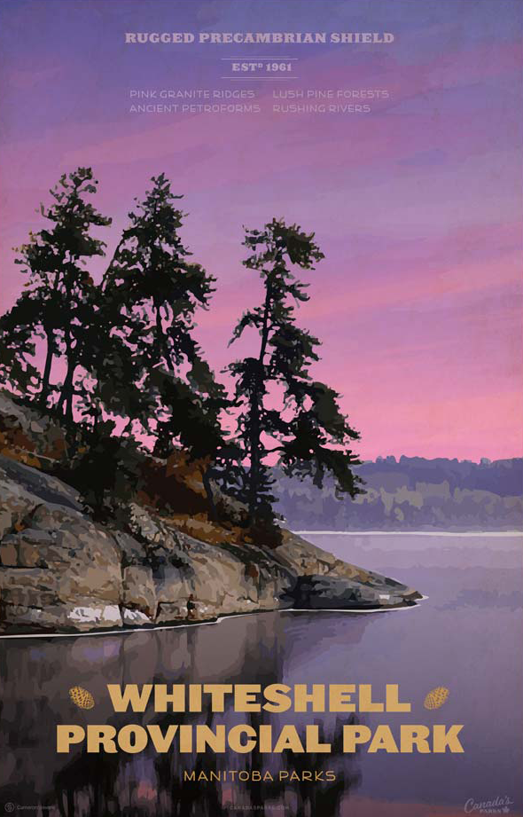

<h1 property="name" id="wb-cont" dir="ltr">Current Alt text: Alt text strategies</h1>

  

    

      <figure>
        <figcaption><b>Whiteshell provincial park</b></figcaption>
        
        
Promotional poster of Whiteshell provincial park

        

          
Image description: Whiteshell provincial park

          
The poster shows a painting that has dark trees on a rock face jutting into a lake, a purple and pink skyline and green forest make up the background.

          
The top of the poster has centered text in three bands of information in somewhat faded purple text that blends with the colour of the skyline:

          <ul>
            <li>The first two bands:
              <ul>
                <li>RUGGED PRECAMBRIAN SHIELD</li>
                <li>EST 1961</li>
              </ul>
            </li>
            <li>The third band is presented in 2 columns:
              <ul>
                <li>PINK GRANITE RIDGES</li>
                <li>ANCIENT PETROFORMS</li>
                <li>LUSH PINE FORESTS</li>
                <li>RUSHING RIVERS</li>
              </ul>
            </li>
          </ul>
          
The bottom of the poster has 3 columns of large text, the first 2 are the title:

          <ul>
            <li>WHITESHELL (with stylized pinecones on each side)</li>
            <li>PROVINCIAL PARK</li>
          </ul>
          
Beneath the title in a smaller font:

          <ul>
            <li>MANITOBA PARKS</li>
          </ul>
          
The bottom of the poster, left-side, middle, and right side in very small font with a low contrast are:

          <ul>
            <li>illegible text</li>
            <li>illegible text</li>
            <li>Canada’s PARKS</li>
          </ul>
        

      </figure>
    

  

  

    <h2 class="h3">HTML</h2>
    <pre><code>
&nbsp;&nbsp;&nbsp;&nbsp;&lt;div&nbsp;class=&quot;pattern&#45;demo&nbsp;mrgn&#45;tp&#45;lg&quot;&gt;
&nbsp;&nbsp;&nbsp;&nbsp;&nbsp;&nbsp;&lt;figure&gt;
&nbsp;&nbsp;&nbsp;&nbsp;&nbsp;&nbsp;&nbsp;&nbsp;&lt;figcaption&gt;&lt;b&gt;Whiteshell&nbsp;provincial&nbsp;park&lt;/b&gt;&lt;/figcaption&gt;
&nbsp;&nbsp;&nbsp;&nbsp;&nbsp;&nbsp;&nbsp;&nbsp;&lt;img&nbsp;src=&quot;./images/whiteshell&#45;pp.png&quot;&nbsp;class=&quot;img&#45;responsive&quot;&nbsp;alt=&quot;&nbsp;&quot;&nbsp;/&gt;
&nbsp;&nbsp;&nbsp;&nbsp;&nbsp;&nbsp;&nbsp;&nbsp;&lt;p&nbsp;class=&quot;mrgn&#45;tp&#45;md&nbsp;small&quot;&gt;Promotional&nbsp;poster&nbsp;of&nbsp;Whiteshell&nbsp;provincial&nbsp;park&lt;/p&gt;
&nbsp;&nbsp;&nbsp;&nbsp;&nbsp;&nbsp;&nbsp;&nbsp;&lt;details&nbsp;class=&quot;mrgn&#45;tp&#45;md&quot;&gt;
&nbsp;&nbsp;&nbsp;&nbsp;&nbsp;&nbsp;&nbsp;&nbsp;&nbsp;&nbsp;&lt;summary&nbsp;class=&quot;wb&#45;toggle&nbsp;small&quot;&nbsp;data&#45;toggle=&quot;{&amp;quot;print&amp;quot;:&amp;quot;on&amp;quot;}&quot;&gt;Image&nbsp;description:&nbsp;Whiteshell&nbsp;provincial&nbsp;park&lt;/summary&gt;
&nbsp;&nbsp;&nbsp;&nbsp;&nbsp;&nbsp;&nbsp;&nbsp;&nbsp;&nbsp;&lt;p&nbsp;class=&quot;mrgn&#45;tp&#45;lg&quot;&gt;The&nbsp;poster&nbsp;shows&nbsp;a&nbsp;painting&nbsp;that&nbsp;has&nbsp;dark&nbsp;trees&nbsp;on&nbsp;a&nbsp;rock&nbsp;face&nbsp;jutting&nbsp;into&nbsp;a&nbsp;lake,&nbsp;a&nbsp;purple&nbsp;and&nbsp;pink&nbsp;skyline&nbsp;and&nbsp;green&nbsp;forest&nbsp;make&nbsp;up&nbsp;the&nbsp;background.&lt;/p&gt;
&nbsp;&nbsp;&nbsp;&nbsp;&nbsp;&nbsp;&nbsp;&nbsp;&nbsp;&nbsp;&lt;p&gt;The&nbsp;top&nbsp;of&nbsp;the&nbsp;poster&nbsp;has&nbsp;centered&nbsp;text&nbsp;in&nbsp;three&nbsp;bands&nbsp;of&nbsp;information&nbsp;in&nbsp;somewhat&nbsp;faded&nbsp;purple&nbsp;text&nbsp;that&nbsp;blends&nbsp;with&nbsp;the&nbsp;colour&nbsp;of&nbsp;the&nbsp;skyline:&lt;/p&gt;
&nbsp;&nbsp;&nbsp;&nbsp;&nbsp;&nbsp;&nbsp;&nbsp;&nbsp;&nbsp;&lt;ul&gt;
&nbsp;&nbsp;&nbsp;&nbsp;&nbsp;&nbsp;&nbsp;&nbsp;&nbsp;&nbsp;&nbsp;&nbsp;&lt;li&gt;The&nbsp;first&nbsp;two&nbsp;bands:
&nbsp;&nbsp;&nbsp;&nbsp;&nbsp;&nbsp;&nbsp;&nbsp;&nbsp;&nbsp;&nbsp;&nbsp;&nbsp;&nbsp;&lt;ul&gt;
&nbsp;&nbsp;&nbsp;&nbsp;&nbsp;&nbsp;&nbsp;&nbsp;&nbsp;&nbsp;&nbsp;&nbsp;&nbsp;&nbsp;&nbsp;&nbsp;&lt;li&gt;RUGGED&nbsp;PRECAMBRIAN&nbsp;SHIELD&lt;/li&gt;
&nbsp;&nbsp;&nbsp;&nbsp;&nbsp;&nbsp;&nbsp;&nbsp;&nbsp;&nbsp;&nbsp;&nbsp;&nbsp;&nbsp;&nbsp;&nbsp;&lt;li&gt;EST&nbsp;1961&lt;/li&gt;
&nbsp;&nbsp;&nbsp;&nbsp;&nbsp;&nbsp;&nbsp;&nbsp;&nbsp;&nbsp;&nbsp;&nbsp;&nbsp;&nbsp;&lt;/ul&gt;
&nbsp;&nbsp;&nbsp;&nbsp;&nbsp;&nbsp;&nbsp;&nbsp;&nbsp;&nbsp;&nbsp;&nbsp;&lt;/li&gt;
&nbsp;&nbsp;&nbsp;&nbsp;&nbsp;&nbsp;&nbsp;&nbsp;&nbsp;&nbsp;&nbsp;&nbsp;&lt;li&gt;The&nbsp;third&nbsp;band&nbsp;is&nbsp;presented&nbsp;in&nbsp;2&nbsp;columns:
&nbsp;&nbsp;&nbsp;&nbsp;&nbsp;&nbsp;&nbsp;&nbsp;&nbsp;&nbsp;&nbsp;&nbsp;&nbsp;&nbsp;&lt;ul&gt;
&nbsp;&nbsp;&nbsp;&nbsp;&nbsp;&nbsp;&nbsp;&nbsp;&nbsp;&nbsp;&nbsp;&nbsp;&nbsp;&nbsp;&nbsp;&nbsp;&lt;li&gt;PINK&nbsp;GRANITE&nbsp;RIDGES&lt;/li&gt;
&nbsp;&nbsp;&nbsp;&nbsp;&nbsp;&nbsp;&nbsp;&nbsp;&nbsp;&nbsp;&nbsp;&nbsp;&nbsp;&nbsp;&nbsp;&nbsp;&lt;li&gt;ANCIENT&nbsp;PETROFORMS&lt;/li&gt;
&nbsp;&nbsp;&nbsp;&nbsp;&nbsp;&nbsp;&nbsp;&nbsp;&nbsp;&nbsp;&nbsp;&nbsp;&nbsp;&nbsp;&nbsp;&nbsp;&lt;li&gt;LUSH&nbsp;PINE&nbsp;FORESTS&lt;/li&gt;
&nbsp;&nbsp;&nbsp;&nbsp;&nbsp;&nbsp;&nbsp;&nbsp;&nbsp;&nbsp;&nbsp;&nbsp;&nbsp;&nbsp;&nbsp;&nbsp;&lt;li&gt;RUSHING&nbsp;RIVERS&lt;/li&gt;
&nbsp;&nbsp;&nbsp;&nbsp;&nbsp;&nbsp;&nbsp;&nbsp;&nbsp;&nbsp;&nbsp;&nbsp;&nbsp;&nbsp;&lt;/ul&gt;
&nbsp;&nbsp;&nbsp;&nbsp;&nbsp;&nbsp;&nbsp;&nbsp;&nbsp;&nbsp;&nbsp;&nbsp;&lt;/li&gt;
&nbsp;&nbsp;&nbsp;&nbsp;&nbsp;&nbsp;&nbsp;&nbsp;&nbsp;&nbsp;&lt;/ul&gt;
&nbsp;&nbsp;&nbsp;&nbsp;&nbsp;&nbsp;&nbsp;&nbsp;&nbsp;&nbsp;&lt;p&gt;The&nbsp;bottom&nbsp;of&nbsp;the&nbsp;poster&nbsp;has&nbsp;3&nbsp;columns&nbsp;of&nbsp;large&nbsp;text,&nbsp;the&nbsp;first&nbsp;2&nbsp;are&nbsp;the&nbsp;title:&lt;/p&gt;
&nbsp;&nbsp;&nbsp;&nbsp;&nbsp;&nbsp;&nbsp;&nbsp;&nbsp;&nbsp;&lt;ul&gt;
&nbsp;&nbsp;&nbsp;&nbsp;&nbsp;&nbsp;&nbsp;&nbsp;&nbsp;&nbsp;&nbsp;&nbsp;&lt;li&gt;WHITESHELL&nbsp;(with&nbsp;stylized&nbsp;pinecones&nbsp;on&nbsp;each&nbsp;side)&lt;/li&gt;
&nbsp;&nbsp;&nbsp;&nbsp;&nbsp;&nbsp;&nbsp;&nbsp;&nbsp;&nbsp;&nbsp;&nbsp;&lt;li&gt;PROVINCIAL&nbsp;PARK&lt;/li&gt;
&nbsp;&nbsp;&nbsp;&nbsp;&nbsp;&nbsp;&nbsp;&nbsp;&nbsp;&nbsp;&lt;/ul&gt;
&nbsp;&nbsp;&nbsp;&nbsp;&nbsp;&nbsp;&nbsp;&nbsp;&nbsp;&nbsp;&lt;p&gt;Beneath&nbsp;the&nbsp;title&nbsp;in&nbsp;a&nbsp;smaller&nbsp;font:&lt;/p&gt;
&nbsp;&nbsp;&nbsp;&nbsp;&nbsp;&nbsp;&nbsp;&nbsp;&nbsp;&nbsp;&lt;ul&gt;
&nbsp;&nbsp;&nbsp;&nbsp;&nbsp;&nbsp;&nbsp;&nbsp;&nbsp;&nbsp;&nbsp;&nbsp;&lt;li&gt;MANITOBA&nbsp;PARKS&lt;/li&gt;
&nbsp;&nbsp;&nbsp;&nbsp;&nbsp;&nbsp;&nbsp;&nbsp;&nbsp;&nbsp;&lt;/ul&gt;
&nbsp;&nbsp;&nbsp;&nbsp;&nbsp;&nbsp;&nbsp;&nbsp;&nbsp;&nbsp;&lt;p&gt;The&nbsp;bottom&nbsp;of&nbsp;the&nbsp;poster,&nbsp;left&#45;side,&nbsp;middle,&nbsp;and&nbsp;right&nbsp;side&nbsp;in&nbsp;very&nbsp;small&nbsp;font&nbsp;with&nbsp;a&nbsp;low&nbsp;contrast&nbsp;are:&lt;/p&gt;
&nbsp;&nbsp;&nbsp;&nbsp;&nbsp;&nbsp;&nbsp;&nbsp;&nbsp;&nbsp;&lt;ul&gt;
&nbsp;&nbsp;&nbsp;&nbsp;&nbsp;&nbsp;&nbsp;&nbsp;&nbsp;&nbsp;&nbsp;&nbsp;&lt;li&gt;illegible&nbsp;text&lt;/li&gt;
&nbsp;&nbsp;&nbsp;&nbsp;&nbsp;&nbsp;&nbsp;&nbsp;&nbsp;&nbsp;&nbsp;&nbsp;&lt;li&gt;illegible&nbsp;text&lt;/li&gt;
&nbsp;&nbsp;&nbsp;&nbsp;&nbsp;&nbsp;&nbsp;&nbsp;&nbsp;&nbsp;&nbsp;&nbsp;&lt;li&gt;Canada’s&nbsp;PARKS&lt;/li&gt;
&nbsp;&nbsp;&nbsp;&nbsp;&nbsp;&nbsp;&nbsp;&nbsp;&nbsp;&nbsp;&lt;/ul&gt;
&nbsp;&nbsp;&nbsp;&nbsp;&nbsp;&nbsp;&nbsp;&nbsp;&lt;/details&gt;
&nbsp;&nbsp;&nbsp;&nbsp;&nbsp;&nbsp;&lt;/figure&gt;
&nbsp;&nbsp;&nbsp;&nbsp;&lt;/div&gt;
	
</code></pre>
  

