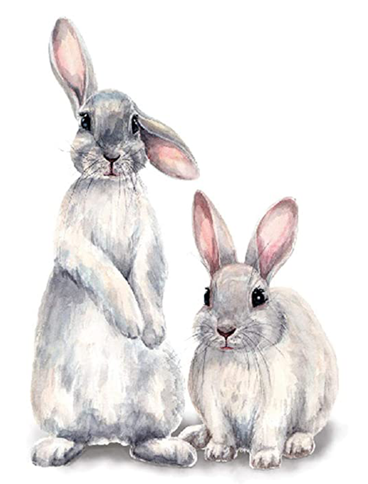

  

    <h1 property="name" id="wb-cont" dir="ltr">Alt text and long descriptions: Canada.ca design system</h1>
    
Alt text investigation

    <h2 class="h3 mrgn-tp-lg">2. eliminate image descriptions (2023-07-24)</h2>
    <ul class="fa-ul">
      <li><a href="global-header-01.html">Global header (eliminate image descriptions)</a></li>
    </ul>
    <h2 class="h3 mrgn-tp-lg">1. Descriptions (2023-06)</h2>
    <ul class="fa-ul">
      <li><a href="alt-text-en-01.html">Album cover (just for fun)</a></li>
      <li><a href="alt-text-en-02.html">Global header – large screen (Current example)</a></li>
      <li><a href="alt-text-en-03.html">Whiteshell provincial park (very descriptive)</a></li>
      <li><a href="alt-text-en-04.html">Whiteshell provincial park (bare-bones description)</a></li>
    </ul>
  

  

    

  

