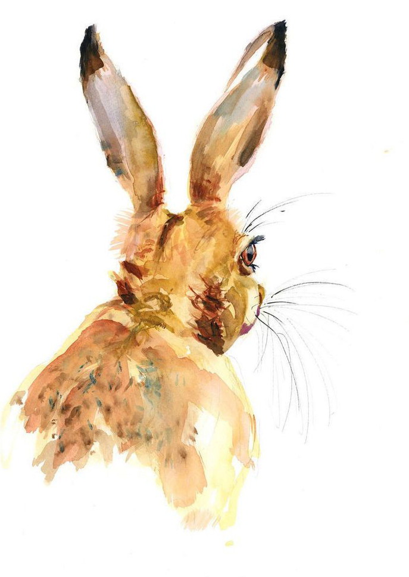

  

    <h1 property="name" id="wb-cont" dir="ltr">Update to Designing content page: Digital Transformation Office</h1>
    <h2 class="mrgn-tp-lg">Current page</h2>
    <ul>
      <li><a href="https://design.canada.ca/continuous-improvement/designing.html">Designing content</a></li>
    </ul>
    <h2>Working document</h2>
    <ul class="list-unstyled fa-ul">
      <li><a href="https://docs.google.com/document/d/1TpVCn7QxkXJQKa0YHHzN_ho8hncNtczQePxuxnKP_mM">Content design</a></li>
    </ul>
    <h2>Prepared for publication</h2>
    
Please review the English and French files.

    <ul class="mrgn-tp-md">
      <li><a href="designing.html">Designing content</a></li>
      <li><a href="concevoir-contenu.html">Concevoir le contenu</a></li>
    </ul>
    <h2>Mockups</h2>
    <ul class="list-unstyled mrgn-tp-lg">
      <li>
        

          
Iteration 2 (2023-01-06)

          <ul class="mrgn-tp-md">
            <li><a href="design-content-02.html">Designing content - full breadcrumb (current)</a></li>
            <li><a href="design-content-03.html">Designing content - short breadcrumb (exclude superfluous canada.cas)</a></li>
            <li><a href="design-content-04.html">Designing content - short breadcrumb (no About)</a></li>
          </ul>
        

      </li>
      <li>
        

          
Iteration 1 (2023-01-03)

          <ul class="mrgn-tp-md">
            <li><a href="design-content-01.html">Designing content</a></li>
          </ul>
        

      </li>
    </ul>
  

  

    

  

