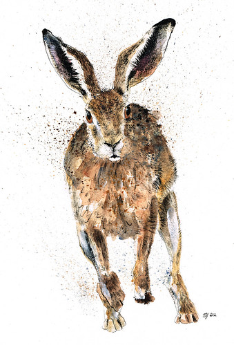

  

    <h1 property="name" id="wb-cont" dir="ltr">Pattern library tasks: Peter's sandbox</h1>
    <h2 class="h3 mrgn-tp-lg">Current Pattern library page</h2>
    
<a href="https://www.canada.ca/en/government/about/design-system/pattern-library.html">Template and pattern library for Canada.ca</a>

    
The current page has 2 calls-to-action with different outcomes:

    <ol>
      <li>A wizard to help find a pattern</li>
      <li>A datatable to find a pattern</li>
    </ol>
    <h2 class="h3 mrgn-tp-lg">Individual pages for separate tasks</h2>
    <ul>
      <li><a href="pattern-library-01.html">Template and pattern library for Canada.ca</a></li>
      <li><a href="pattern-library-wizard-01.html">Help to find the rigth pattern</a></li>
    </ul>
  

  

    

  

