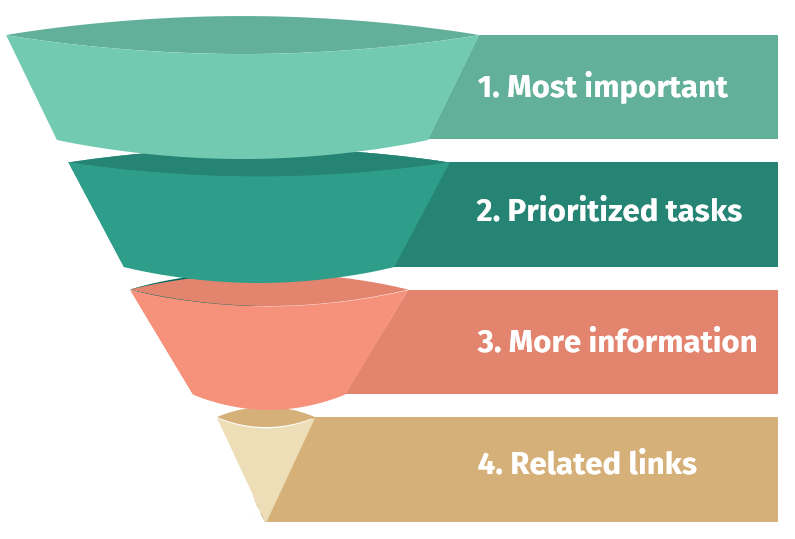

<h3>2.1 Start with the most important information</h3>

Start your content with the most important information, and be direct. When people scan web pages, they tend to start in the top left hand corner and scan to the right and down. As they move down the page, they scan less and less to the right.

Organize your content using an inverted pyramid structure to:

<ul>
  <li>guide your audience to the information they need to complete their task </li>
  <li>place supporting and relevant details toward the end of the text </li>
</ul>
<figure class="mrgn-bttm-lg">
  <figcaption class="text-center"><strong>Figure 1</strong></figcaption>
  </figure>

The inverted pyramid (Figure 1) for ordering content on a web page is divided into four sections, the widest at the top down to the peak at the bottom.

<ol>
  <li>Most important
    <ul>
      <li>start with the most important idea, step or information</li>
    </ul>
  </li>
  <li>Prioritized tasks
    <ul>
      <li>add details and tasks in order of importance</li>
      <li>keep all task related content in the centre of the page</li>
      <li>use links to direct people to key information and tasks</li>
    </ul>
  </li>
  <li>More information
    <ul>
      <li>include information for audiences who want to learn more or have more knowledge of the topic or service, but only if it makes sense</li>
    </ul>
  </li>
  <li>Related links
    <ul>
      <li>add links only if they relate to content that supports completion of the task on the web page (for example, laws or publications)</li>
    </ul>
  </li>
</ol>
