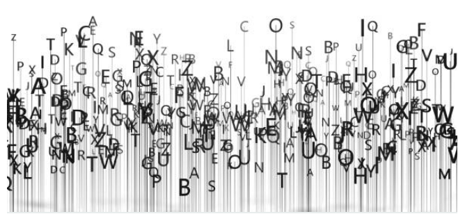

<h1 property="name" id="wb-cont" dir="ltr">Canada.ca Content Style Guide: Canada.ca design system</h1>

  

    

      

        
<strong>Version</strong>: 2.1.2 (October 21, 2020)

        
These are the rules to create web content that can be easily found, understood and used. They are based on writing principles and techniques that help make web content clear and adapted to the needs of all people. Use the style guide with the <cite>Canada.ca Content and Information Specification</cite> when you're designing and organizing web content.

      

      

    

  

  <section class="wb-eqht gc-drmt">
    

      <section>
        <h3 class="h5"><a href="02-style-guide-02-en.html">Introduction</a></h3>
        
Find the Guide’s purpose, use, summary of changes, and related policies, standards and procedures

      </section>
    

    

      <section>
        <h3 class="h5"><a href="02-style-guide-03-en.html">1.0 Writing principles</a></h3>
        
Rules that reflect how people read and use web content

      </section>
    

    

      <section>
        <h3 class="h5"><a href="02-style-guide-04-en.html">2.0 Plain language</a></h3>
        
How to write in plain language

      </section>
    

    

      <section>
        <h3 class="h5"><a href="02-style-guide-05-en.html">3.0 Tone</a></h3>
        
How to write with the proper tone

      </section>
    

    

      <section>
        <h3 class="h5"><a href="02-style-guide-06-en.html">4.0 Style</a></h3>
        
Keep style and punctuation simple

      </section>
    

    

      <section>
        <h3 class="h5"><a href="02-style-guide-07-en.html">5.0 Content structure</a></h3>
        
Use structure and layout to help people find what they need

      </section>
    

    

      <section>
        <h3 class="h5"><a href="02-style-guide-08-en.html">6.0 Images and videos</a></h3>
        
Use images and videos strategically and effectively

      </section>
    

    

      <section>
        <h3 class="h5"><a href="02-style-guide-09-en.html">7.0 Links</a></h3>
        
Use links and anchors strategically and effectively  

      </section>
    

    

      <section>
        <h3 class="h5"><a href="02-style-guide-10-en.html">Web content makeovers</a></h3>
        
Two case studies - plain language and complex table improvements

      </section>
    

    

      <section>
        <h3 class="h5"><a href="02-style-guide-11-en.html">Resources</a></h3>
        
Sources used to create the <cite>Content Style Guide</cite>

      </section>
    

    

      <section>
        <h3 class="h5"><a href="02-style-guide-12-en.html">Copyright</a></h3>
        
Copyright for the <cite>Content Style Guide</cite>

      </section>
    

    

      <section>
        <h3 class="h5"><a href="02-style-guide-13-en.html">Formats</a></h3>
        

      </section>
    
    
  </section>

